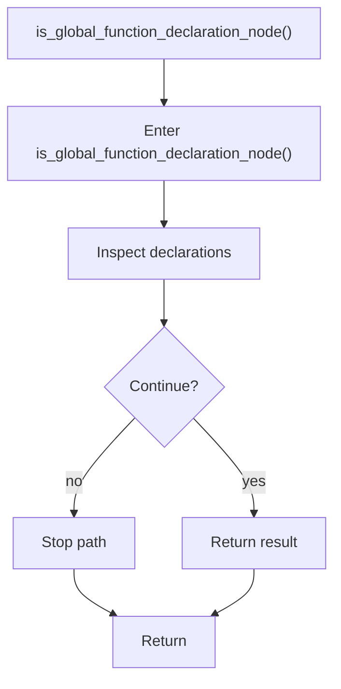

# is_global_function_declaration_node.cpp

- Source document: [statement.cpp.md](../../statement.cpp.md)
- Purpose: decoupled implementation logic for a future code unit.

### is_global_function_declaration_node()
This routine owns one focused piece of the file's behavior. It appears near line 143.

Inside the body, it mainly handles inspect or rewrite declarations.

The caller receives a computed result or status from this step.

What it does:
- inspect or rewrite declarations

Flow:

