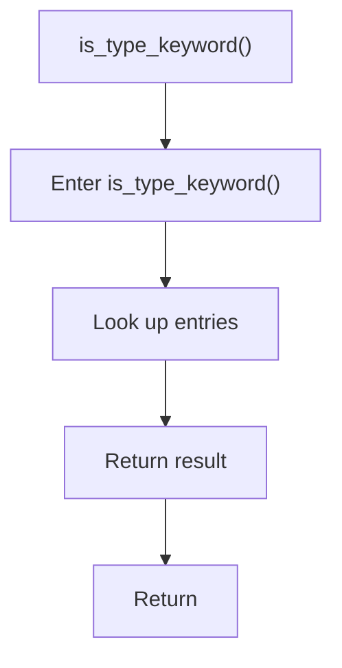

# is_type_keyword.cpp

- Source document: [statement.cpp.md](../../statement.cpp.md)
- Purpose: decoupled implementation logic for a future code unit.

### is_type_keyword()
This routine owns one focused piece of the file's behavior. It appears near line 12.

Inside the body, it mainly handles look up entries in previously collected maps or sets.

The caller receives a computed result or status from this step.

What it does:
- look up entries in previously collected maps or sets

Flow:

