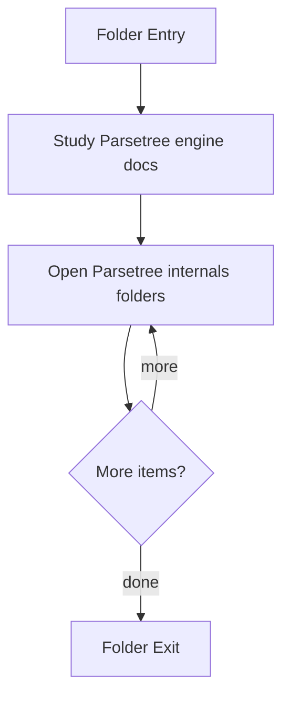

# ParseTree

- Folder: docs/Codebase/Microservice/Modules/Source/SyntacticBrokenAST/ParseTree
- Descendant source docs: 19
- Generated on: 2026-04-23

## Logic Summary
Parse-tree engine implementation for building, linking, symbolizing, and rendering the tree artifacts.

## Subsystem Story
This folder mixes concrete local documents with deeper child subsystems. Read the local docs to understand the visible behavior first, then descend into the child folders for the lower-level detail that supports it.

## Folder Flow

## Child Folders By Logic
### ParseTree Internals
These child folders continue the subsystem by covering Private parse-tree implementation helpers used by the engine internals..
- Internal/ : Private parse-tree implementation helpers used by the engine internals.

## Documents By Logic
### ParseTree Engine
These documents explain the local implementation by covering Implements parsing, shadow-tree building, symbolization, hash linking, rendering, and reporting. and Builds the main parse tree, dependency context, and filtered shadow tree for the source corpus..
- code_generator.cpp.md : Implements parsing, shadow-tree building, symbolization, hash linking, rendering, and reporting.
- core.cpp.md : Builds the main parse tree, dependency context, and filtered shadow tree for the source corpus.
- dependency_utils.cpp.md : Implements parsing, shadow-tree building, symbolization, hash linking, rendering, and reporting.
- hash_links.cpp.md : Implements parsing, shadow-tree building, symbolization, hash linking, rendering, and reporting.
- hash_links_collect.cpp.md : Implements parsing, shadow-tree building, symbolization, hash linking, rendering, and reporting.
- hash_links_common.cpp.md : Implements parsing, shadow-tree building, symbolization, hash linking, rendering, and reporting.
- hash_links_resolve.cpp.md : Implements parsing, shadow-tree building, symbolization, hash linking, rendering, and reporting.
- symbols.cpp.md : Implements parsing, shadow-tree building, symbolization, hash linking, rendering, and reporting.
- symbols_builder.cpp.md : Implements parsing, shadow-tree building, symbolization, hash linking, rendering, and reporting.
- symbols_queries.cpp.md : Implements parsing, shadow-tree building, symbolization, hash linking, rendering, and reporting.
- symbols_utils.cpp.md : Implements parsing, shadow-tree building, symbolization, hash linking, rendering, and reporting.

## Reading Hint
- Read the local file docs first for concrete behavior, then descend into the child folders for narrower subsystem details.

