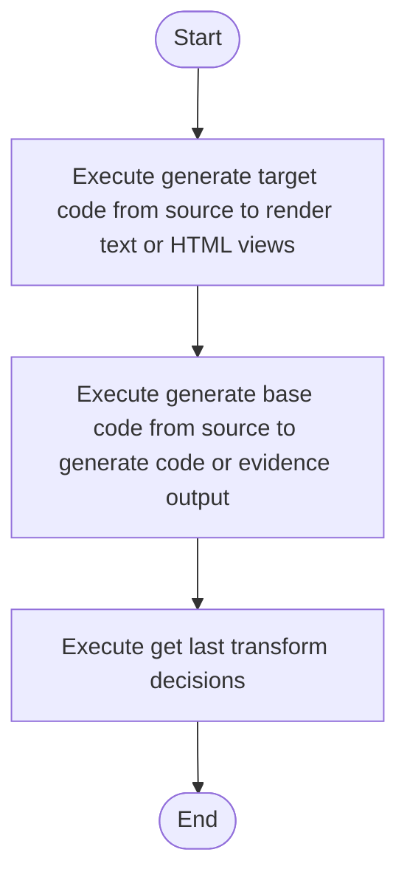

# code_generator.cpp

- Source: Microservice/Modules/Source/SyntacticBrokenAST/ParseTree/code_generator.cpp
- Kind: C++ implementation
- Lines: 46
- Role: Implements parsing, shadow-tree building, symbolization, hash linking, rendering, and reporting.
- Chronology: Runs across the middle of the microservice flow to build parse trees, hash links, symbol tables, reports, and rendered outputs.

## Notable Symbols
- get_last_transform_decisions
- generate_base_code_from_source
- render_creational_evidence_view
- generate_target_code_from_source

## Direct Dependencies
- parse_tree_code_generator.hpp
- Transform/creational_transform_pipeline.hpp

## File Outline
### Responsibility

This source file implements one internal part of the generic parse-tree engine. It contributes specialized behavior such as code generation, dependency handling, symbolization, or hash-link construction after the raw tree exists. This source file implements one of the generic middle-stage services in the C++ pipeline. It is executed after sources are loaded and before the final report and rendered outputs are written.

### Position In The Flow

Runs across the middle of the microservice flow to build parse trees, hash links, symbol tables, reports, and rendered outputs.

### Main Surface Area

Implements parsing, shadow-tree building, symbolization, hash linking, rendering, and reporting. The main surface area is easiest to track through symbols such as get_last_transform_decisions, generate_base_code_from_source, render_creational_evidence_view, and generate_target_code_from_source. It collaborates directly with parse_tree_code_generator.hpp and Transform/creational_transform_pipeline.hpp.

## File Activity


## Function Walkthrough

### get_last_transform_decisions
This routine owns one focused piece of the file's behavior. It appears near line 9.

The caller receives a computed result or status from this step.

Key operations:
- This routine is primarily structural and does not expose obvious runtime operations from static inspection.

Activity:
```mermaid
flowchart TD
    Start([get_last_transform_decisions()])
    N0[Enter get_last_transform_decisions()]
    N1[Apply the routine's local logic]
    N2[Return the result to the caller]
    End([Return])
    Start --> N0
    N0 --> N1
    N1 --> N2
    N2 --> End
```

### generate_base_code_from_source
This routine owns one focused piece of the file's behavior. It appears near line 14.

Inside the body, it mainly handles generate code or evidence output.

The caller receives a computed result or status from this step.

Key operations:
- generate code or evidence output

Activity:
```mermaid
flowchart TD
    Start([generate_base_code_from_source()])
    N0[Enter generate_base_code_from_source()]
    N1[Generate code or evidence output]
    N2[Return the result to the caller]
    End([Return])
    Start --> N0
    N0 --> N1
    N1 --> N2
    N2 --> End
```

### generate_target_code_from_source
This routine owns one focused piece of the file's behavior. It appears near line 27.

Inside the body, it mainly handles render text or HTML views.

The caller receives a computed result or status from this step.

Key operations:
- render text or HTML views

Activity:
```mermaid
flowchart TD
    Start([generate_target_code_from_source()])
    N0[Enter generate_target_code_from_source()]
    N1[Render text or HTML views]
    N2[Return the result to the caller]
    End([Return])
    Start --> N0
    N0 --> N1
    N1 --> N2
    N2 --> End
```

## Documentation Note
- This markdown file is part of the generated docs/Codebase mirror.
- It was generated from the repository state on 2026-04-23 after reading the existing docs corpus and the current source tree.

