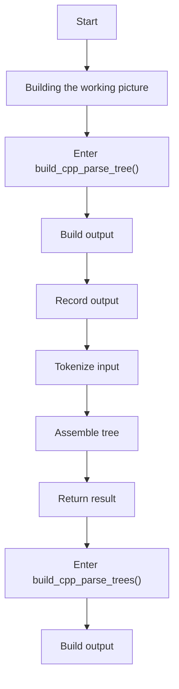
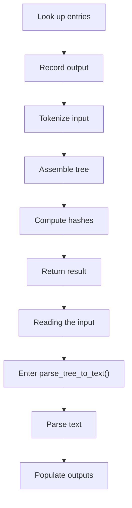
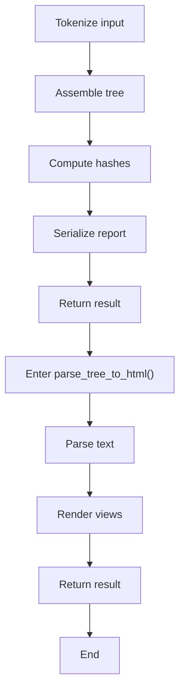
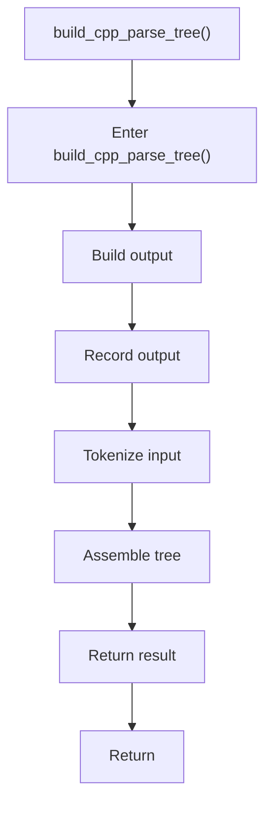
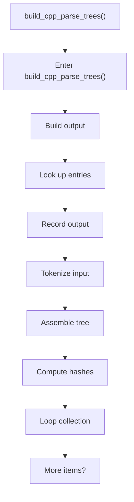
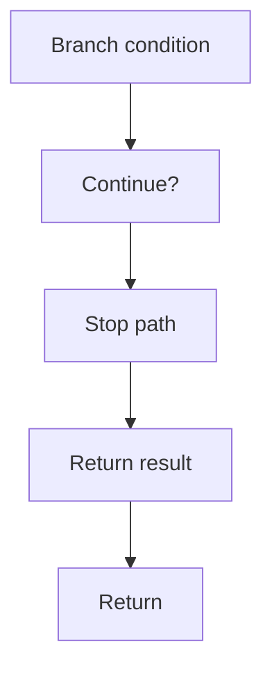
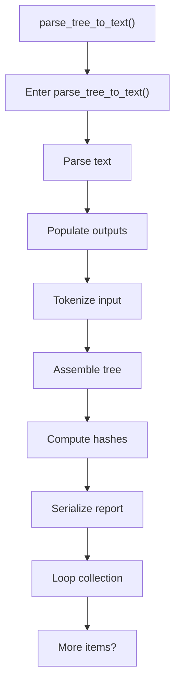
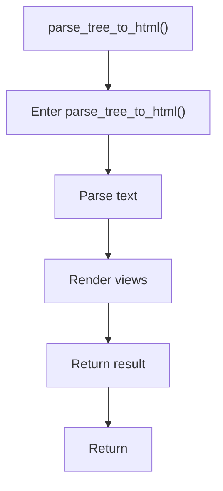

# core.cpp

- Source: Microservice/Modules/Source/SyntacticBrokenAST/ParseTree/core.cpp
- Kind: C++ implementation
- Lines: 224

## Story
### What Happens Here

This file implements the high-level parse-tree assembly loop. It creates the root and file nodes, parses each source file into the main tree, collects cross-file dependency information, and then derives the filtered shadow tree that keeps only relevant pattern evidence. This source file implements one internal part of the generic parse-tree engine. It contributes specialized behavior such as dependency handling, symbolization, hash-link construction, rendering, or older generation helpers after the raw tree exists. This source file implements one of the generic middle-stage services in the C++ pipeline. It is executed after sources are loaded and before the final report and rendered outputs are written.

### Why It Matters In The Flow

Runs across the middle of the microservice flow to build parse trees, hash links, symbol tables, documentation tags, reports, and rendered outputs.

### What To Watch While Reading

Builds the main parse tree, dependency context, and filtered shadow tree for the source corpus. The main surface area is easiest to track through symbols such as build_cpp_parse_tree, build_cpp_parse_trees, parse_tree_to_text, and std::string. It collaborates directly with parse_tree.hpp, Internal/parse_tree_internal.hpp, Language-and-Structure/language_tokens.hpp, and Language-and-Structure/lexical_structure_hooks.hpp.

## Program Flow
This diagram follows the action path in plain words. Decision diamonds show where the file can stop, branch, or repeat work instead of simply passing through a straight line.

### Block 1 - Program Flow Details
#### Part 1

#### Part 2

#### Part 3

## Reading Map
Read this file as: Builds the main parse tree, dependency context, and filtered shadow tree for the source corpus.

Where it sits in the run: Runs across the middle of the microservice flow to build parse trees, hash links, symbol tables, documentation tags, reports, and rendered outputs.

Names worth recognizing while reading: build_cpp_parse_tree, build_cpp_parse_trees, parse_tree_to_text, std::string, parse_tree_to_html, and render_tree_html.

It leans on nearby contracts or tools such as parse_tree.hpp, Internal/parse_tree_internal.hpp, Language-and-Structure/language_tokens.hpp, Language-and-Structure/lexical_structure_hooks.hpp, parse_tree_symbols.hpp, and Output-and-Rendering/tree_html_renderer.hpp.

## Story Groups

### Reading The Input
These steps turn raw text or arguments into something the program can follow.
- parse_tree_to_text() (line 189): Parse source text into structured values, populate output fields or accumulators, and parse or tokenize input text
- parse_tree_to_html() (line 219): Parse source text into structured values and render text or HTML views

### Building The Working Picture
These steps assemble the trees, models, or bundles used by the rest of the file.
- build_cpp_parse_tree() (line 15): Build or append the next output structure, record derived output into collections, and parse or tokenize input text
- build_cpp_parse_trees() (line 28): Build or append the next output structure, look up entries in previously collected maps or sets, and record derived output into collections

## Function Stories

### build_cpp_parse_tree()
This routine assembles a larger structure from the inputs it receives. It appears near line 15.

Inside the body, it mainly handles build or append the next output structure, record derived output into collections, parse or tokenize input text, and assemble tree or artifact structures.

The caller receives a computed result or status from this step.

What it does:
- build or append the next output structure
- record derived output into collections
- parse or tokenize input text
- assemble tree or artifact structures

Flow:

### build_cpp_parse_trees()
This routine assembles a larger structure from the inputs it receives. It appears near line 28.

Inside the body, it mainly handles build or append the next output structure, look up entries in previously collected maps or sets, record derived output into collections, and parse or tokenize input text.

The implementation iterates over a collection or repeated workload. It branches on runtime conditions instead of following one fixed path. The caller receives a computed result or status from this step.

What it does:
- build or append the next output structure
- look up entries in previously collected maps or sets
- record derived output into collections
- parse or tokenize input text
- assemble tree or artifact structures
- compute hash metadata
- iterate over the active collection
- branch on runtime conditions

Flow:

### Block 2 - build_cpp_parse_trees() Details
#### Part 1

#### Part 2

### parse_tree_to_text()
This routine ingests source content and turns it into a more useful structured form. It appears near line 189.

Inside the body, it mainly handles parse source text into structured values, populate output fields or accumulators, parse or tokenize input text, and assemble tree or artifact structures.

The implementation iterates over a collection or repeated workload. It branches on runtime conditions instead of following one fixed path. The caller receives a computed result or status from this step.

What it does:
- parse source text into structured values
- populate output fields or accumulators
- parse or tokenize input text
- assemble tree or artifact structures
- compute hash metadata
- serialize report content
- iterate over the active collection
- branch on runtime conditions

Flow:

### Block 3 - parse_tree_to_text() Details
#### Part 1

#### Part 2

### parse_tree_to_html()
This routine ingests source content and turns it into a more useful structured form. It appears near line 219.

Inside the body, it mainly handles parse source text into structured values and render text or HTML views.

The caller receives a computed result or status from this step.

What it does:
- parse source text into structured values
- render text or HTML views

Flow:

## Documentation Note
- This markdown file is part of the generated docs/Codebase mirror.
- It was generated from the repository state on 2026-04-23 after reading the existing docs corpus and the current source tree.
