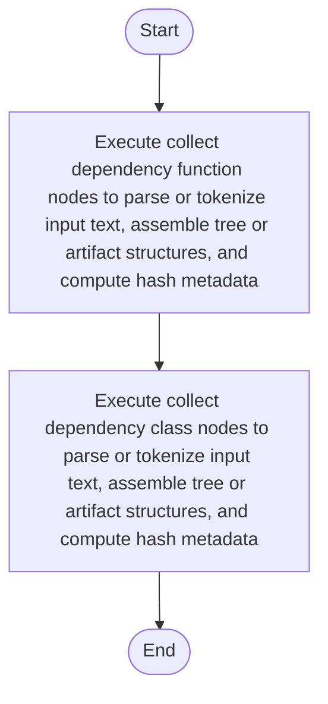

# dependency_utils.cpp

- Source: Microservice/Modules/Source/SyntacticBrokenAST/ParseTree/dependency_utils.cpp
- Kind: C++ implementation
- Lines: 46
- Role: Implements parsing, shadow-tree building, symbolization, hash linking, rendering, and reporting.
- Chronology: Runs across the middle of the microservice flow to build parse trees, hash links, symbol tables, reports, and rendered outputs.

## Notable Symbols
- collect_dependency_class_nodes
- collect_dependency_function_nodes

## Direct Dependencies
- parse_tree_dependency_utils.hpp
- parse_tree_symbols.hpp
- utility

## File Outline
### Responsibility

This source file implements one internal part of the generic parse-tree engine. It contributes specialized behavior such as code generation, dependency handling, symbolization, or hash-link construction after the raw tree exists. This source file implements one of the generic middle-stage services in the C++ pipeline. It is executed after sources are loaded and before the final report and rendered outputs are written.

### Position In The Flow

Runs across the middle of the microservice flow to build parse trees, hash links, symbol tables, reports, and rendered outputs.

### Main Surface Area

Implements parsing, shadow-tree building, symbolization, hash linking, rendering, and reporting. The main surface area is easiest to track through symbols such as collect_dependency_class_nodes and collect_dependency_function_nodes. It collaborates directly with parse_tree_dependency_utils.hpp, parse_tree_symbols.hpp, and utility.

## File Activity


## Function Walkthrough

### collect_dependency_class_nodes
This routine connects discovered items back into the broader model owned by the file. It appears near line 6.

Inside the body, it mainly handles parse or tokenize input text, assemble tree or artifact structures, compute hash metadata, and iterate over the active collection.

The implementation iterates over a collection or repeated workload. The caller receives a computed result or status from this step.

Key operations:
- parse or tokenize input text
- assemble tree or artifact structures
- compute hash metadata
- iterate over the active collection

Activity:
```mermaid
flowchart TD
    Start([collect_dependency_class_nodes()])
    N0[Enter collect_dependency_class_nodes()]
    N1[Parse or tokenize input text]
    N2[Assemble tree or artifact structures]
    N3[Compute hash metadata]
    N4[Iterate over the active collection]
    N5[Return the result to the caller]
    End([Return])
    Start --> N0
    N0 --> N1
    N1 --> N2
    N2 --> N3
    N3 --> N4
    N4 --> N5
    N5 --> End
```

### collect_dependency_function_nodes
This routine connects discovered items back into the broader model owned by the file. It appears near line 26.

Inside the body, it mainly handles parse or tokenize input text, assemble tree or artifact structures, compute hash metadata, and iterate over the active collection.

The implementation iterates over a collection or repeated workload. The caller receives a computed result or status from this step.

Key operations:
- parse or tokenize input text
- assemble tree or artifact structures
- compute hash metadata
- iterate over the active collection

Activity:
```mermaid
flowchart TD
    Start([collect_dependency_function_nodes()])
    N0[Enter collect_dependency_function_nodes()]
    N1[Parse or tokenize input text]
    N2[Assemble tree or artifact structures]
    N3[Compute hash metadata]
    N4[Iterate over the active collection]
    N5[Return the result to the caller]
    End([Return])
    Start --> N0
    N0 --> N1
    N1 --> N2
    N2 --> N3
    N3 --> N4
    N4 --> N5
    N5 --> End
```

## Documentation Note
- This markdown file is part of the generated docs/Codebase mirror.
- It was generated from the repository state on 2026-04-23 after reading the existing docs corpus and the current source tree.

