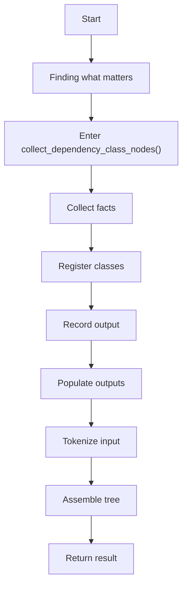
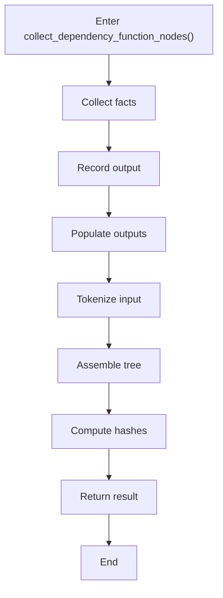
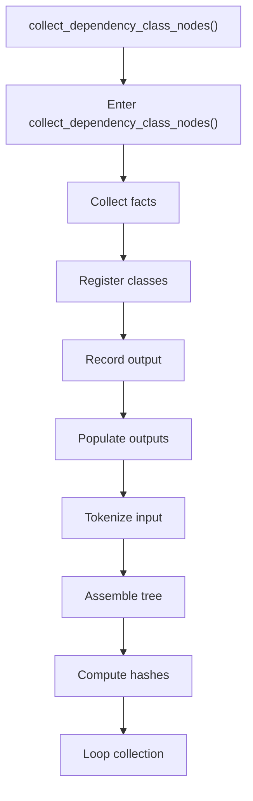
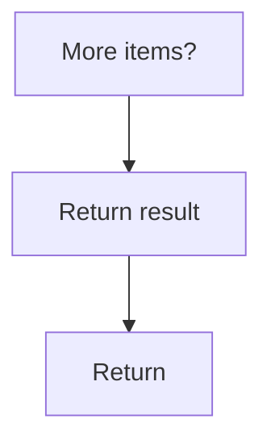
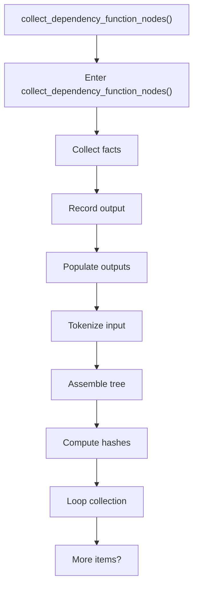
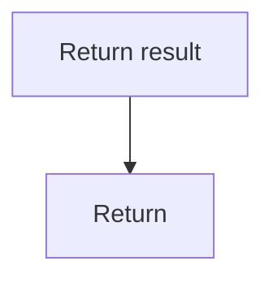

# dependency_utils.cpp

- Source: Microservice/Modules/Source/SyntacticBrokenAST/ParseTree/dependency_utils.cpp
- Kind: C++ implementation
- Lines: 46

## Story
### What Happens Here

This source file implements one internal part of the generic parse-tree engine. It contributes specialized behavior such as dependency handling, symbolization, hash-link construction, rendering, or older generation helpers after the raw tree exists. This source file implements one of the generic middle-stage services in the C++ pipeline. It is executed after sources are loaded and before the final report and rendered outputs are written.

### Why It Matters In The Flow

Runs across the middle of the microservice flow to build parse trees, hash links, symbol tables, documentation tags, reports, and rendered outputs.

### What To Watch While Reading

Implements parsing, shadow-tree building, symbolization, hash linking, rendering, and reporting. The main surface area is easiest to track through symbols such as collect_dependency_class_nodes and collect_dependency_function_nodes. It collaborates directly with parse_tree_dependency_utils.hpp, parse_tree_symbols.hpp, and utility.

## Program Flow
This diagram follows the action path in plain words. Decision diamonds show where the file can stop, branch, or repeat work instead of simply passing through a straight line.

### Block 1 - Program Flow Details
#### Part 1

#### Part 2

## Reading Map
Read this file as: Implements parsing, shadow-tree building, symbolization, hash linking, rendering, and reporting.

Where it sits in the run: Runs across the middle of the microservice flow to build parse trees, hash links, symbol tables, documentation tags, reports, and rendered outputs.

Names worth recognizing while reading: collect_dependency_class_nodes and collect_dependency_function_nodes.

It leans on nearby contracts or tools such as parse_tree_dependency_utils.hpp, parse_tree_symbols.hpp, and utility.

## Story Groups

### Finding What Matters
These steps pick out the facts, traces, and relationships that later stages need.
- collect_dependency_class_nodes() (line 6): Collect derived facts for later stages, inspect or register class-level information, and record derived output into collections
- collect_dependency_function_nodes() (line 26): Collect derived facts for later stages, record derived output into collections, and populate output fields or accumulators

## Function Stories

### collect_dependency_class_nodes()
This routine connects discovered items back into the broader model owned by the file. It appears near line 6.

Inside the body, it mainly handles collect derived facts for later stages, inspect or register class-level information, record derived output into collections, and populate output fields or accumulators.

The implementation iterates over a collection or repeated workload. The caller receives a computed result or status from this step.

What it does:
- collect derived facts for later stages
- inspect or register class-level information
- record derived output into collections
- populate output fields or accumulators
- parse or tokenize input text
- assemble tree or artifact structures
- compute hash metadata
- iterate over the active collection

Flow:

### Block 2 - collect_dependency_class_nodes() Details
#### Part 1

#### Part 2

### collect_dependency_function_nodes()
This routine connects discovered items back into the broader model owned by the file. It appears near line 26.

Inside the body, it mainly handles collect derived facts for later stages, record derived output into collections, populate output fields or accumulators, and parse or tokenize input text.

The implementation iterates over a collection or repeated workload. The caller receives a computed result or status from this step.

What it does:
- collect derived facts for later stages
- record derived output into collections
- populate output fields or accumulators
- parse or tokenize input text
- assemble tree or artifact structures
- compute hash metadata
- iterate over the active collection

Flow:

### Block 3 - collect_dependency_function_nodes() Details
#### Part 1

#### Part 2

## Documentation Note
- This markdown file is part of the generated docs/Codebase mirror.
- It was generated from the repository state on 2026-04-23 after reading the existing docs corpus and the current source tree.
