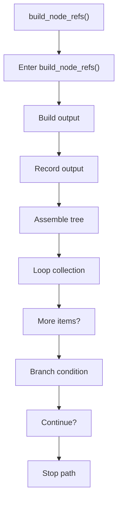
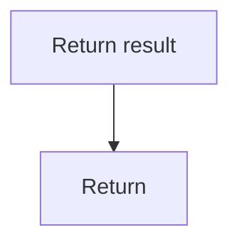

# build_node_refs.cpp

- Source document: [hash_links_collect.cpp.md](../../hash_links_collect.cpp.md)
- Purpose: decoupled implementation logic for a future code unit.

### build_node_refs()
This routine assembles a larger structure from the inputs it receives. It appears near line 104.

Inside the body, it mainly handles build or append the next output structure, record derived output into collections, assemble tree or artifact structures, and iterate over the active collection.

The implementation iterates over a collection or repeated workload. It branches on runtime conditions instead of following one fixed path. The caller receives a computed result or status from this step.

What it does:
- build or append the next output structure
- record derived output into collections
- assemble tree or artifact structures
- iterate over the active collection
- branch on runtime conditions

Flow:

### Block 3 - build_node_refs() Details
#### Part 1

#### Part 2

