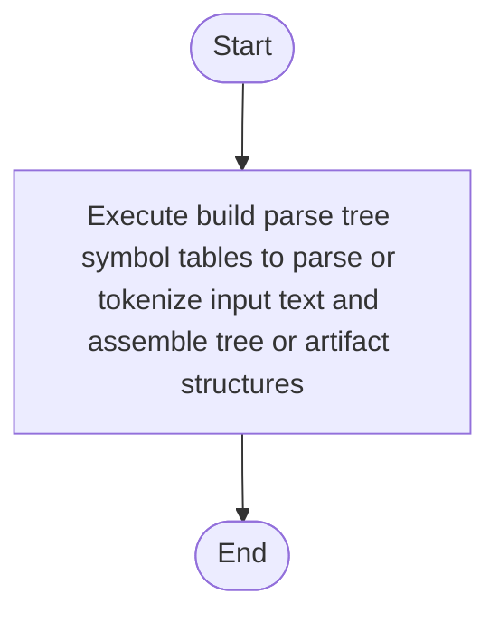

# symbols.cpp

- Source: Microservice/Modules/Source/SyntacticBrokenAST/ParseTree/symbols.cpp
- Kind: C++ implementation
- Lines: 11
- Role: Implements parsing, shadow-tree building, symbolization, hash linking, rendering, and reporting.
- Chronology: Runs across the middle of the microservice flow to build parse trees, hash links, symbol tables, reports, and rendered outputs.

## Notable Symbols
- build_parse_tree_symbol_tables
- parse_tree_symbols_internal::build_symbol_tables_with_builder

## Direct Dependencies
- parse_tree_symbols.hpp
- Internal/parse_tree_symbols_internal.hpp

## File Outline
### Responsibility

This source file implements one internal part of the generic parse-tree engine. It contributes specialized behavior such as code generation, dependency handling, symbolization, or hash-link construction after the raw tree exists. This source file implements one of the generic middle-stage services in the C++ pipeline. It is executed after sources are loaded and before the final report and rendered outputs are written.

### Position In The Flow

Runs across the middle of the microservice flow to build parse trees, hash links, symbol tables, reports, and rendered outputs.

### Main Surface Area

Implements parsing, shadow-tree building, symbolization, hash linking, rendering, and reporting. The main surface area is easiest to track through symbols such as build_parse_tree_symbol_tables and parse_tree_symbols_internal::build_symbol_tables_with_builder. It collaborates directly with parse_tree_symbols.hpp and Internal/parse_tree_symbols_internal.hpp.

## File Activity


## Function Walkthrough

### build_parse_tree_symbol_tables
This routine assembles a larger structure from the inputs it receives. It appears near line 4.

Inside the body, it mainly handles parse or tokenize input text and assemble tree or artifact structures.

The caller receives a computed result or status from this step.

Key operations:
- parse or tokenize input text
- assemble tree or artifact structures

Activity:
```mermaid
flowchart TD
    Start([build_parse_tree_symbol_tables()])
    N0[Enter build_parse_tree_symbol_tables()]
    N1[Parse or tokenize input text]
    N2[Assemble tree or artifact structures]
    N3[Return the result to the caller]
    End([Return])
    Start --> N0
    N0 --> N1
    N1 --> N2
    N2 --> N3
    N3 --> End
```

## Documentation Note
- This markdown file is part of the generated docs/Codebase mirror.
- It was generated from the repository state on 2026-04-23 after reading the existing docs corpus and the current source tree.

