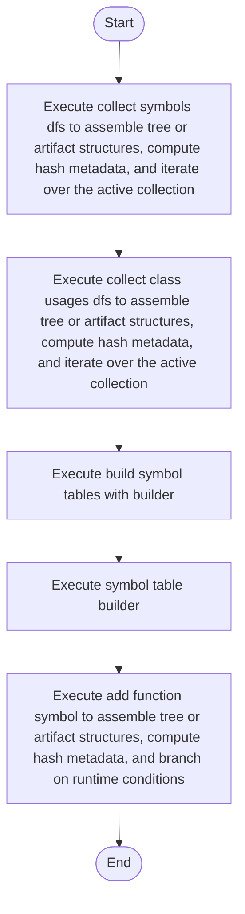

# symbols_builder.cpp

- Source: Microservice/Modules/Source/SyntacticBrokenAST/ParseTree/symbols_builder.cpp
- Kind: C++ implementation
- Lines: 216
- Role: Implements parsing, shadow-tree building, symbolization, hash linking, rendering, and reporting.
- Chronology: Runs across the middle of the microservice flow to build parse trees, hash links, symbol tables, reports, and rendered outputs.

## Notable Symbols
- SymbolTableBuilder
- options
- add_class_symbol
- add_function_symbol
- collect_symbols_dfs
- collect_class_usages_dfs
- build_symbol_tables_with_builder
- builder

## Direct Dependencies
- Internal/parse_tree_symbols_internal.hpp
- cstddef
- functional
- string
- unordered_map
- utility
- vector

## File Outline
### Responsibility

This source file implements one internal part of the generic parse-tree engine. It contributes specialized behavior such as code generation, dependency handling, symbolization, or hash-link construction after the raw tree exists. This source file implements one of the generic middle-stage services in the C++ pipeline. It is executed after sources are loaded and before the final report and rendered outputs are written.

### Position In The Flow

Runs across the middle of the microservice flow to build parse trees, hash links, symbol tables, reports, and rendered outputs.

### Main Surface Area

Implements parsing, shadow-tree building, symbolization, hash linking, rendering, and reporting. The main surface area is easiest to track through symbols such as SymbolTableBuilder, options, add_class_symbol, and add_function_symbol. It collaborates directly with Internal/parse_tree_symbols_internal.hpp, cstddef, functional, and string.

## File Activity


## Function Walkthrough

### SymbolTableBuilder
This routine owns one focused piece of the file's behavior. It appears near line 16.

Key operations:
- This routine is primarily structural and does not expose obvious runtime operations from static inspection.

Activity:
```mermaid
flowchart TD
    Start([SymbolTableBuilder()])
    N0[Enter SymbolTableBuilder()]
    N1[Apply the routine's local logic]
    N2[Hand control back to the caller]
    End([Return])
    Start --> N0
    N0 --> N1
    N1 --> N2
    N2 --> End
```

### add_class_symbol
This routine owns one focused piece of the file's behavior. It appears near line 30.

Inside the body, it mainly handles assemble tree or artifact structures, compute hash metadata, and branch on runtime conditions.

It branches on runtime conditions instead of following one fixed path. The caller receives a computed result or status from this step.

Key operations:
- assemble tree or artifact structures
- compute hash metadata
- branch on runtime conditions

Activity:
```mermaid
flowchart TD
    Start([add_class_symbol()])
    N0[Enter add_class_symbol()]
    N1[Assemble tree or artifact structures]
    N2[Compute hash metadata]
    N3[Branch on runtime conditions]
    N4[Return the result to the caller]
    End([Return])
    Start --> N0
    N0 --> N1
    N1 --> N2
    N2 --> N3
    N3 --> N4
    N4 --> End
```

### add_function_symbol
This routine owns one focused piece of the file's behavior. It appears near line 65.

Inside the body, it mainly handles assemble tree or artifact structures, compute hash metadata, and branch on runtime conditions.

It branches on runtime conditions instead of following one fixed path. The caller receives a computed result or status from this step.

Key operations:
- assemble tree or artifact structures
- compute hash metadata
- branch on runtime conditions

Activity:
```mermaid
flowchart TD
    Start([add_function_symbol()])
    N0[Enter add_function_symbol()]
    N1[Assemble tree or artifact structures]
    N2[Compute hash metadata]
    N3[Branch on runtime conditions]
    N4[Return the result to the caller]
    End([Return])
    Start --> N0
    N0 --> N1
    N1 --> N2
    N2 --> N3
    N3 --> N4
    N4 --> End
```

### collect_symbols_dfs
This routine connects discovered items back into the broader model owned by the file. It appears near line 101.

Inside the body, it mainly handles assemble tree or artifact structures, compute hash metadata, iterate over the active collection, and branch on runtime conditions.

The implementation iterates over a collection or repeated workload. It branches on runtime conditions instead of following one fixed path.

Key operations:
- assemble tree or artifact structures
- compute hash metadata
- iterate over the active collection
- branch on runtime conditions

Activity:
```mermaid
flowchart TD
    Start([collect_symbols_dfs()])
    N0[Enter collect_symbols_dfs()]
    N1[Assemble tree or artifact structures]
    N2[Compute hash metadata]
    N3[Iterate over the active collection]
    N4[Branch on runtime conditions]
    N5[Hand control back to the caller]
    End([Return])
    Start --> N0
    N0 --> N1
    N1 --> N2
    N2 --> N3
    N3 --> N4
    N4 --> N5
    N5 --> End
```

### collect_class_usages_dfs
This routine connects discovered items back into the broader model owned by the file. It appears near line 137.

Inside the body, it mainly handles assemble tree or artifact structures, compute hash metadata, iterate over the active collection, and branch on runtime conditions.

The implementation iterates over a collection or repeated workload. It branches on runtime conditions instead of following one fixed path.

Key operations:
- assemble tree or artifact structures
- compute hash metadata
- iterate over the active collection
- branch on runtime conditions

Activity:
```mermaid
flowchart TD
    Start([collect_class_usages_dfs()])
    N0[Enter collect_class_usages_dfs()]
    N1[Assemble tree or artifact structures]
    N2[Compute hash metadata]
    N3[Iterate over the active collection]
    N4[Branch on runtime conditions]
    N5[Hand control back to the caller]
    End([Return])
    Start --> N0
    N0 --> N1
    N1 --> N2
    N2 --> N3
    N3 --> N4
    N4 --> N5
    N5 --> End
```

### build_symbol_tables_with_builder
This routine assembles a larger structure from the inputs it receives. It appears near line 200.

The caller receives a computed result or status from this step.

Key operations:
- This routine is primarily structural and does not expose obvious runtime operations from static inspection.

Activity:
```mermaid
flowchart TD
    Start([build_symbol_tables_with_builder()])
    N0[Enter build_symbol_tables_with_builder()]
    N1[Apply the routine's local logic]
    N2[Return the result to the caller]
    End([Return])
    Start --> N0
    N0 --> N1
    N1 --> N2
    N2 --> End
```

## Documentation Note
- This markdown file is part of the generated docs/Codebase mirror.
- It was generated from the repository state on 2026-04-23 after reading the existing docs corpus and the current source tree.

