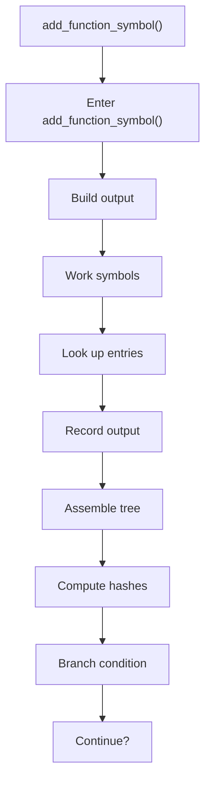
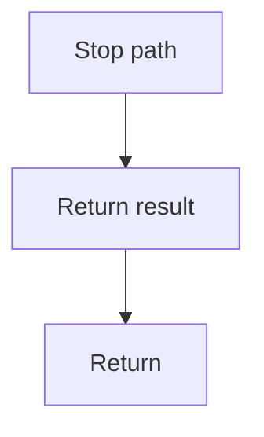

# add_function_symbol.cpp

- Source document: [symbols_builder.cpp.md](../../symbols_builder.cpp.md)
- Purpose: decoupled implementation logic for a future code unit.

### add_function_symbol()
This routine owns one focused piece of the file's behavior. It appears near line 65.

Inside the body, it mainly handles build or append the next output structure, work with symbol-oriented state, look up entries in previously collected maps or sets, and record derived output into collections.

It branches on runtime conditions instead of following one fixed path. The caller receives a computed result or status from this step.

What it does:
- build or append the next output structure
- work with symbol-oriented state
- look up entries in previously collected maps or sets
- record derived output into collections
- assemble tree or artifact structures
- compute hash metadata
- branch on runtime conditions

Flow:

### Block 3 - add_function_symbol() Details
#### Part 1

#### Part 2

