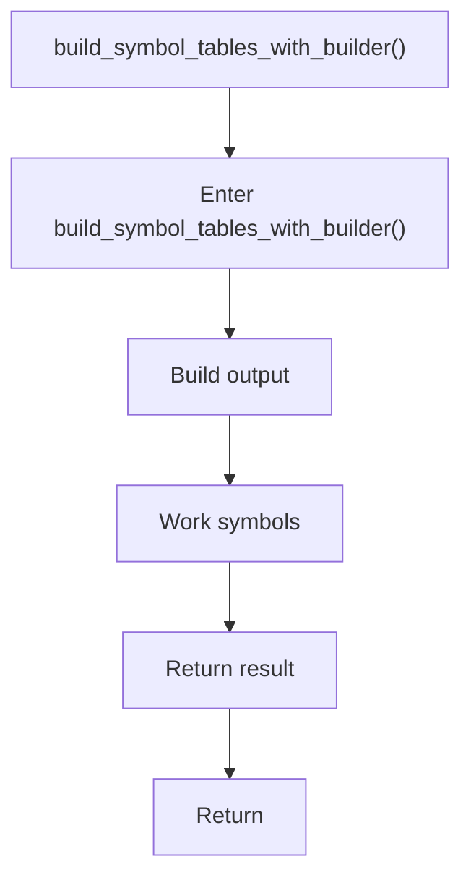

# build_symbol_tables_with_builder.cpp

- Source document: [symbols_builder.cpp.md](../../symbols_builder.cpp.md)
- Purpose: decoupled implementation logic for a future code unit.

### build_symbol_tables_with_builder()
This routine assembles a larger structure from the inputs it receives. It appears near line 200.

Inside the body, it mainly handles build or append the next output structure and work with symbol-oriented state.

The caller receives a computed result or status from this step.

What it does:
- build or append the next output structure
- work with symbol-oriented state

Flow:

