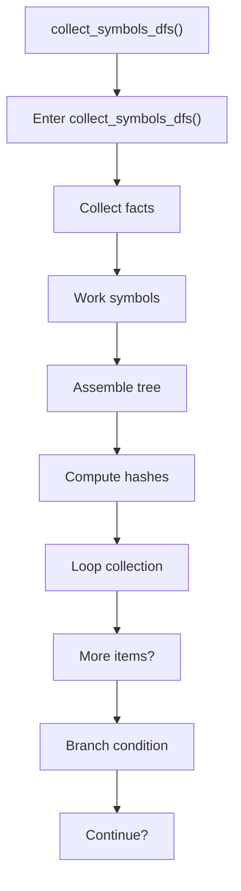
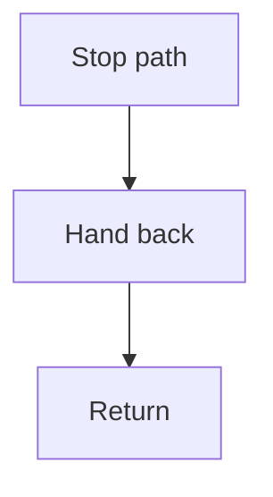

# collect_symbols_dfs.cpp

- Source document: [symbols_builder.cpp.md](../../symbols_builder.cpp.md)
- Purpose: decoupled implementation logic for a future code unit.

### collect_symbols_dfs()
This routine connects discovered items back into the broader model owned by the file. It appears near line 101.

Inside the body, it mainly handles collect derived facts for later stages, work with symbol-oriented state, assemble tree or artifact structures, and compute hash metadata.

The implementation iterates over a collection or repeated workload. It branches on runtime conditions instead of following one fixed path.

What it does:
- collect derived facts for later stages
- work with symbol-oriented state
- assemble tree or artifact structures
- compute hash metadata
- iterate over the active collection
- branch on runtime conditions

Flow:

### Block 4 - collect_symbols_dfs() Details
#### Part 1

#### Part 2

