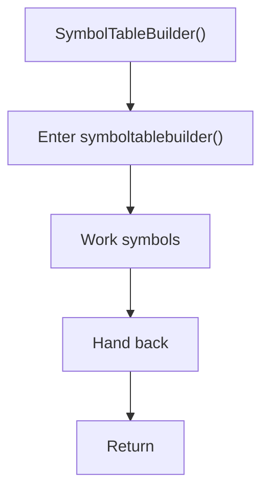

# symboltablebuilder.cpp

- Source document: [symbols_builder.cpp.md](../../symbols_builder.cpp.md)
- Purpose: decoupled implementation logic for a future code unit.

### SymbolTableBuilder()
This routine owns one focused piece of the file's behavior. It appears near line 16.

Inside the body, it mainly handles work with symbol-oriented state.

What it does:
- work with symbol-oriented state

Flow:

