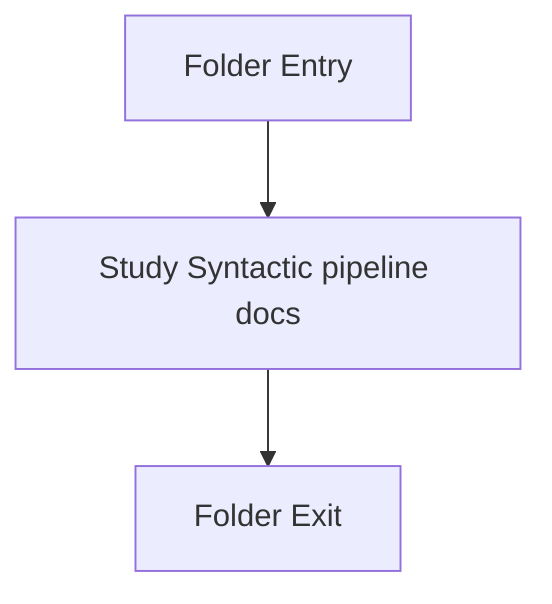

# Pipeline-Orchestration

- Folder: docs/Codebase/Microservice/Modules/Source/SyntacticBrokenAST/Pipeline-Orchestration
- Descendant source docs: 1
- Generated on: 2026-04-23

## Logic Summary
Top-level pipeline orchestration and report-shaping code for the syntactic subsystem.

## Subsystem Story
This folder is mostly leaf-level. The local documents here carry the main explanation of the subsystem without requiring much extra descent.

## Folder Flow

## Documents By Logic
### Syntactic Pipeline
These documents explain the local implementation by covering Runs the ordered analysis pipeline and packages the resulting artifacts, documentation tags, traces, and metrics..
- algorithm_pipeline.cpp.md : Runs the ordered analysis pipeline and packages the resulting artifacts, documentation tags, traces, and metrics.

## Reading Hint
- This folder is mostly leaf-level. Read the local file docs to understand the logic in this area.

