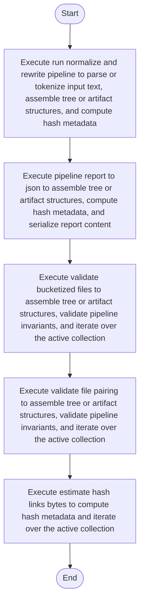

# algorithm_pipeline.cpp

- Source: Microservice/Modules/Source/SyntacticBrokenAST/algorithm_pipeline.cpp
- Kind: C++ implementation
- Lines: 788
- Role: Implements parsing, shadow-tree building, symbolization, hash linking, rendering, and reporting.
- Chronology: Orchestrates the core analysis stages once source files have been loaded.

## Notable Symbols
- file_has_bucket_kind
- validate_file_pairing
- validate_bucketized_files
- estimate_parse_tree_bytes
- estimate_creational_tree_bytes
- estimate_symbol_table_bytes
- estimate_node_ref_bytes
- estimate_hash_links_bytes
- json_escape
- append_json_string_array
- append_json_number_array
- append_json_node_refs

## Direct Dependencies
- algorithm_pipeline.hpp
- language_tokens.hpp
- parse_tree_symbols.hpp
- algorithm
- chrono
- sstream
- string
- unordered_map
- unordered_set
- vector

## Implementation Story
This file implements the ordered core pipeline of the C++ system. It measures and runs the parse, detect, hash-link, monolithic-generation, and validation stages, and then packages the resulting trees, tables, traces, and metrics into the artifact bundle returned to the application layer. This source file implements one of the generic middle-stage services in the C++ pipeline. It is executed after sources are loaded and before the final report and rendered outputs are written.   Implements parsing, shadow-tree building, symbolization, hash linking, rendering, and reporting.   Orchestrates the core analysis stages once source files have been loaded.  The implementation surface is easiest to recognize through symbols such as file_has_bucket_kind, validate_file_pairing, validate_bucketized_files, and estimate_parse_tree_bytes.  In practice it collaborates directly with algorithm_pipeline.hpp, language_tokens.hpp, parse_tree_symbols.hpp, and algorithm.

## Activity Diagram

## Documentation Note
- This markdown file is part of the generated docs/Codebase mirror.
- It was generated from the repository state on 2026-04-22 after reading the existing docs corpus and the current source tree.

