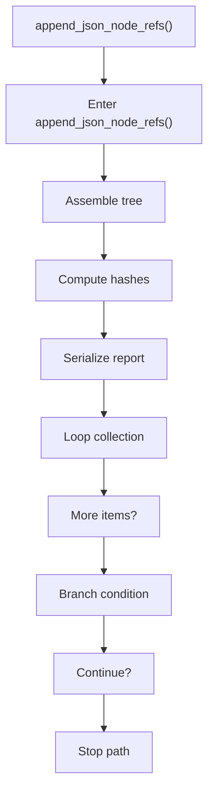
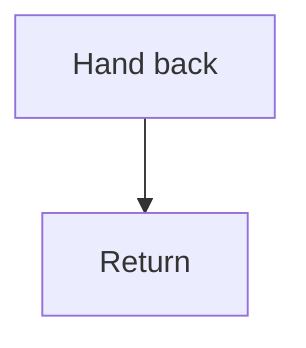

# append_json_node_refs.cpp

- Source document: [algorithm_pipeline.cpp.md](../../algorithm_pipeline.cpp.md)
- Purpose: decoupled implementation logic for a future code unit.

### append_json_node_refs()
This helper reshapes small pieces of data so the surrounding code can stay readable. It appears near line 271.

Inside the body, it mainly handles assemble tree or artifact structures, compute hash metadata, serialize report content, and iterate over the active collection.

The implementation iterates over a collection or repeated workload. It branches on runtime conditions instead of following one fixed path.

What it does:
- assemble tree or artifact structures
- compute hash metadata
- serialize report content
- iterate over the active collection
- branch on runtime conditions

Flow:

### Block 4 - append_json_node_refs() Details
#### Part 1

#### Part 2

