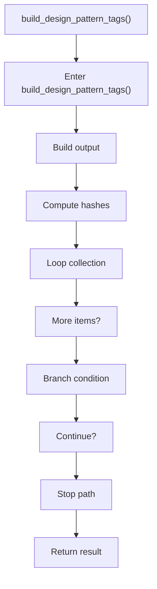

# build_design_pattern_tags.cpp

- Source document: [algorithm_pipeline.cpp.md](../../algorithm_pipeline.cpp.md)
- Purpose: decoupled implementation logic for a future code unit.

### build_design_pattern_tags()
This routine assembles a larger structure from the inputs it receives. It appears near line 339.

Inside the body, it mainly handles build or append the next output structure, compute hash metadata, iterate over the active collection, and branch on runtime conditions.

The implementation iterates over a collection or repeated workload. It branches on runtime conditions instead of following one fixed path. The caller receives a computed result or status from this step.

What it does:
- build or append the next output structure
- compute hash metadata
- iterate over the active collection
- branch on runtime conditions

Flow:

### Block 6 - build_design_pattern_tags() Details
#### Part 1

#### Part 2

