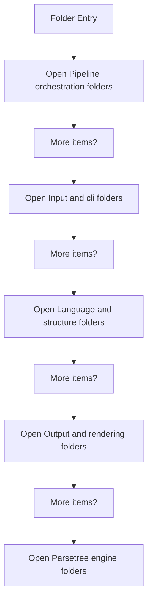
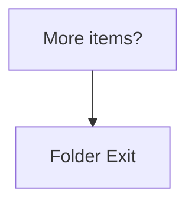

# SyntacticBrokenAST

- Folder: docs/Codebase/Microservice/Modules/Source/SyntacticBrokenAST
- Descendant source docs: 26
- Generated on: 2026-04-23

## Logic Summary
Generic syntactic pipeline services such as CLI parsing, source reading, lexical hooks, documentation tagging, and reporting.

## Subsystem Story
This folder mainly acts as a navigation layer. Use it to understand how the deeper child folders divide the subsystem into smaller concerns.

## Folder Flow

### Block 1 - Folder Flow Details
#### Part 1

#### Part 2

## Child Folders By Logic
### Pipeline Orchestration
These child folders continue the subsystem by covering Top-level pipeline orchestration and report-shaping code for the syntactic subsystem..
- Pipeline-Orchestration/ : Top-level pipeline orchestration and report-shaping code for the syntactic subsystem.

### Input And CLI
These child folders continue the subsystem by covering Input discovery, source loading, and command-argument handling for the syntactic subsystem..
- Input-and-CLI/ : Input discovery, source loading, and command-argument handling for the syntactic subsystem.

### Language And Structure
These child folders continue the subsystem by covering Language token definitions and structural hook logic that guide pattern-aware parsing..
- Language-and-Structure/ : Language token definitions and structural hook logic that guide pattern-aware parsing.

### Output And Rendering
These child folders continue the subsystem by covering HTML/text rendering helpers and older generated-output helpers for syntactic outputs..
- Output-and-Rendering/ : HTML/text rendering helpers and older generated-output helpers for syntactic outputs.

### ParseTree Engine
These child folders continue the subsystem by covering Parse-tree engine implementation for building, linking, symbolizing, and rendering the tree artifacts..
- ParseTree/ : Parse-tree engine implementation for building, linking, symbolizing, and rendering the tree artifacts.

## Reading Hint
- Use the child folder groups to navigate deeper into this subsystem.
