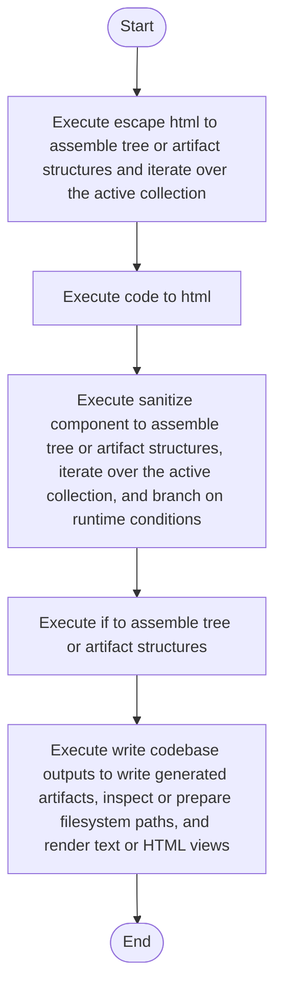

# codebase_output_writer.cpp

- Source: Microservice/Modules/Source/SyntacticBrokenAST/codebase_output_writer.cpp
- Kind: C++ implementation
- Lines: 118
- Role: Implements parsing, shadow-tree building, symbolization, hash linking, rendering, and reporting.
- Chronology: Runs across the middle of the microservice flow to build parse trees, hash links, symbol tables, reports, and rendered outputs.

## Notable Symbols
- escape_html
- code_to_html
- sanitize_component
- write_codebase_outputs
- base_cpp
- target_cpp
- base_html
- target_html

## Direct Dependencies
- codebase_output_writer.hpp
- filesystem
- fstream
- cctype
- string

## Implementation Story
This file implements the final output-materialization step for generated code views. It sanitizes the target pattern name, ensures the output folders exist, and writes both .cpp and .html renderings of the base and target code artifacts. This source file implements one of the generic middle-stage services in the C++ pipeline. It is executed after sources are loaded and before the final report and rendered outputs are written.   Implements parsing, shadow-tree building, symbolization, hash linking, rendering, and reporting.   Runs across the middle of the microservice flow to build parse trees, hash links, symbol tables, reports, and rendered outputs.  The implementation surface is easiest to recognize through symbols such as escape_html, code_to_html, sanitize_component, and write_codebase_outputs.  In practice it collaborates directly with codebase_output_writer.hpp, filesystem, fstream, and cctype.

## Activity Diagram

## Documentation Note
- This markdown file is part of the generated docs/Codebase mirror.
- It was generated from the repository state on 2026-04-22 after reading the existing docs corpus and the current source tree.

