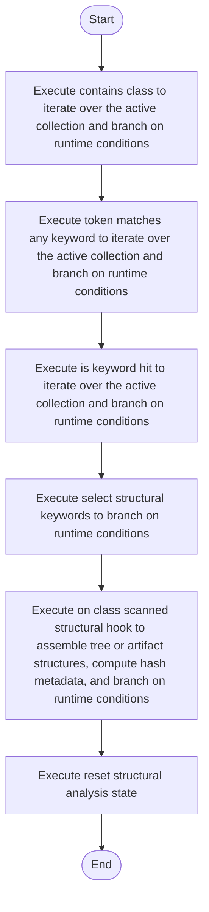

# lexical_structure_hooks.cpp

- Source: Microservice/Modules/Source/SyntacticBrokenAST/lexical_structure_hooks.cpp
- Kind: C++ implementation
- Lines: 150
- Role: Implements parsing, shadow-tree building, symbolization, hash linking, rendering, and reporting.
- Chronology: Runs across the middle of the microservice flow to build parse trees, hash links, symbol tables, reports, and rendered outputs.

## Notable Symbols
- contains_class
- token_matches_any_keyword
- is_keyword_hit
- select_structural_keywords
- on_class_scanned_structural_hook
- reset_structural_analysis_state
- is_crucial_class_name
- get_crucial_class_registry

## Direct Dependencies
- lexical_structure_hooks.hpp
- Logic/behavioural_structural_hooks.hpp
- Logic/creational_structural_hooks.hpp
- language_tokens.hpp
- functional
- string
- utility
- vector

## Implementation Story
This file implements the bridge between generic parsing and pattern-specific structural keywords. It resolves the keyword set for the selected source pattern, scans class declarations for hits, and records the crucial classes that later drive relevance filtering and symbol tracking. This source file implements one of the generic middle-stage services in the C++ pipeline. It is executed after sources are loaded and before the final report and rendered outputs are written.   Implements parsing, shadow-tree building, symbolization, hash linking, rendering, and reporting.   Runs across the middle of the microservice flow to build parse trees, hash links, symbol tables, reports, and rendered outputs.  The implementation surface is easiest to recognize through symbols such as contains_class, token_matches_any_keyword, is_keyword_hit, and select_structural_keywords.  In practice it collaborates directly with lexical_structure_hooks.hpp, Logic/behavioural_structural_hooks.hpp, Logic/creational_structural_hooks.hpp, and language_tokens.hpp.

## Activity Diagram

## Documentation Note
- This markdown file is part of the generated docs/Codebase mirror.
- It was generated from the repository state on 2026-04-22 after reading the existing docs corpus and the current source tree.

