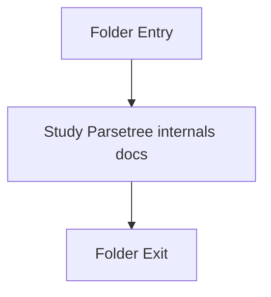

# Internal

- Folder: docs/Codebase/Microservice/Modules/Source/ParseTree/Internal
- Descendant source docs: 8
- Generated on: 2026-04-23

## Logic Summary
Private parse-tree implementation helpers used by the engine internals.

## Subsystem Story
This folder is mostly leaf-level. The local documents here carry the main explanation of the subsystem without requiring much extra descent.

## Folder Flow

## Documents By Logic
### ParseTree Internals
These documents explain the local implementation by covering Implements parsing, shadow-tree building, symbolization, hash linking, rendering, and reporting. and Constructs file-local parse-tree nodes from tokenized source lines and scoped statements..
- bucket.cpp.md : Implements parsing, shadow-tree building, symbolization, hash linking, rendering, and reporting.
- build.cpp.md : Constructs file-local parse-tree nodes from tokenized source lines and scoped statements.
- hash.cpp.md : Implements parsing, shadow-tree building, symbolization, hash linking, rendering, and reporting.
- line.cpp.md : Implements parsing, shadow-tree building, symbolization, hash linking, rendering, and reporting.
- node_path.cpp.md : Implements parsing, shadow-tree building, symbolization, hash linking, rendering, and reporting.
- registry.cpp.md : Implements parsing, shadow-tree building, symbolization, hash linking, rendering, and reporting.
- relevance.cpp.md : Implements parsing, shadow-tree building, symbolization, hash linking, rendering, and reporting.
- statement.cpp.md : Implements parsing, shadow-tree building, symbolization, hash linking, rendering, and reporting.

## Reading Hint
- This folder is mostly leaf-level. Read the local file docs to understand the logic in this area.

