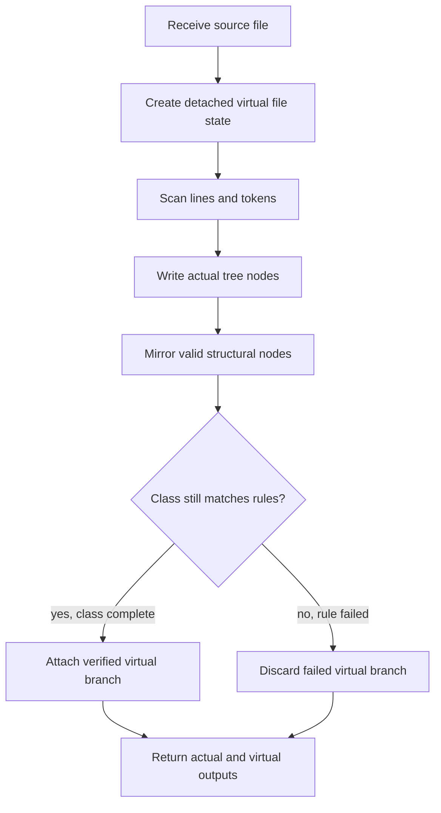

# build.cpp

- Source: `Codebase/Microservice/Modules/Source/SyntacticBrokenAST/ParseTree/Internal/build.cpp`
- Kind: C++ implementation blueprint
- Local role: build file-local actual parse-tree nodes while coordinating detached virtual-broken class candidates.

## Read First

This file is the line parser for the actual class-generation path. It reads source text one file at a time, creates actual parse-tree nodes under the already attached file node, records hash traces, and keeps the detached virtual-broken candidate in sync only while the structural verifier still accepts the class shape.

The important distinction is that the actual parse tree is always written into the file-local tree. The virtual-broken candidate is only a temporary side branch; it is attached after a verified class completes, or discarded immediately when the expected structure fails.

## File-Level Flow

Quick summary: this is the local workflow inside `build.cpp`. It starts from one source file and exits with the actual file node plus optional detached-virtual results for the caller.

Why this slice is separate: this diagram shows how this file's responsibilities connect. Function internals are documented in the lower sections instead of being repeated here.

## Function Map

- `parse_file_content_into_node(...)`: parses one file into the actual file node and coordinates detached virtual-broken class branches.
- `initialize_detached_virtual_file_state(...)`: prepares a detached file-root mirror for possible verified virtual branches.
- `begin_detached_virtual_class_branch(...)`: starts a temporary virtual class branch after lexical structure detection says the class is worth tracking.
- `append_detached_virtual_candidate_node(...)`: copies eligible actual statement nodes into the temporary virtual branch.
- `enter_detached_virtual_scope(...)` and `exit_detached_virtual_scope(...)`: keep virtual scope depth aligned with actual brace scopes.
- `finalize_detached_virtual_class_branch(...)`: marks a completed candidate as verified and keeps it for caller attachment.
- `discard_detached_virtual_class_branch(...)`: deletes the temporary candidate when the expected class structure fails.
- `collect_class_definitions_by_file(...)`: maps class or struct declarations to the file where they were defined.
- `collect_symbol_dependencies_for_file(...)`: emits cross-file symbol dependency nodes from class-name usage.
- `resolve_include_dependencies(...)`: rewrites include dependency nodes from basename-only to basename plus resolved path.

## Detailed Flow Docs

These files break down the large local workflow without duplicating the main diagram:

- [build_program_flow_01.cpp.md](./Build/Flow/build_program_flow_01.cpp.md): line parsing, actual node writes, detached virtual candidate handling.
- [build_program_flow_02.cpp.md](./Build/Flow/build_program_flow_02.cpp.md): post-parse dependency extraction and include resolution.

## Local Boundaries

This file owns:

- actual statement and block node construction for a single source file
- line-level hash trace collection
- factory callsite trace collection
- detached virtual-broken branch lifecycle while parsing a class
- class definition discovery, symbol dependency extraction, and include dependency resolution

This file does not own:

- source entry orchestration across many files
- root main-tree creation
- final output rendering
- expected-structure rule definitions inside the lexical structure hooks

## Acceptance Checks

- File-level Mermaid shows only this file's workflow and uses no generic action-bucket nodes.
- Function names appear in prose headings or maps, not as the main action labels inside Mermaid nodes.
- The actual tree and detached virtual-broken branch are shown as separate outputs with attach/discard behavior.
- Cross-file references appear only as source path and caller/callee boundary notes.
