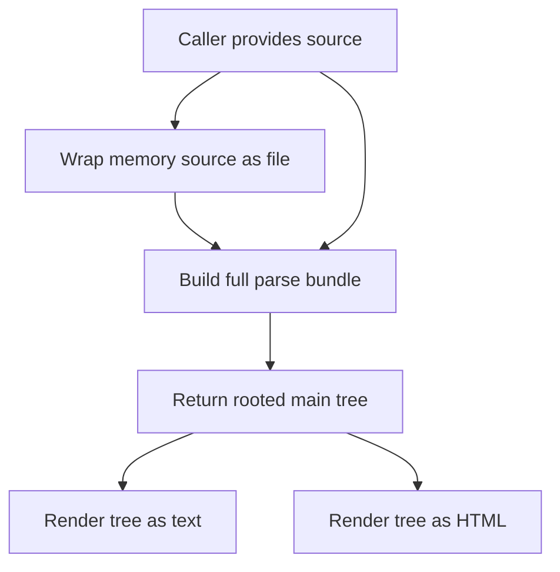
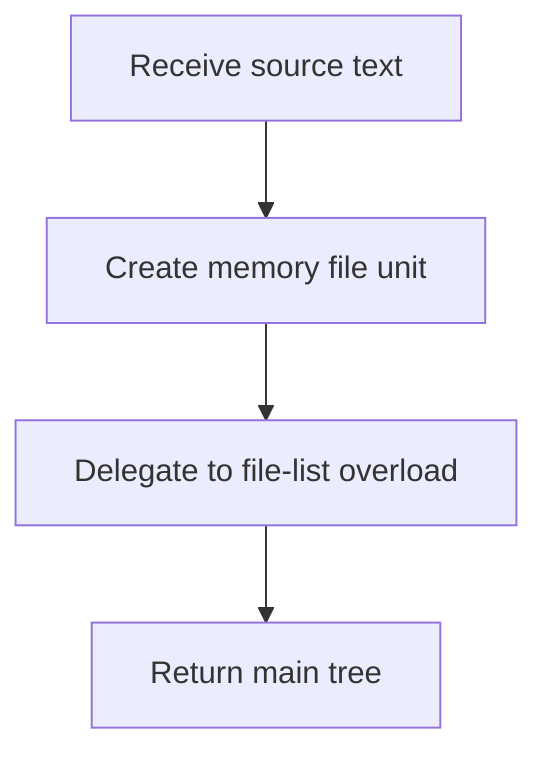
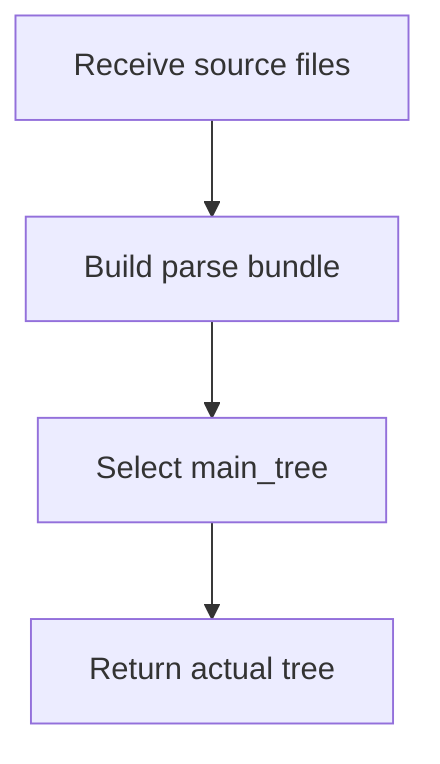
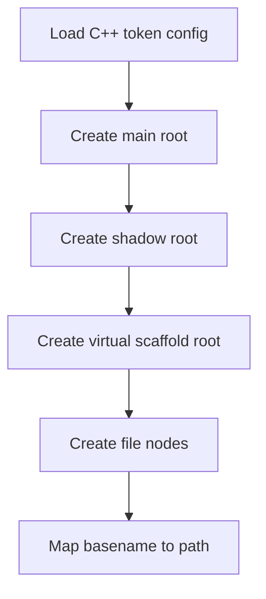
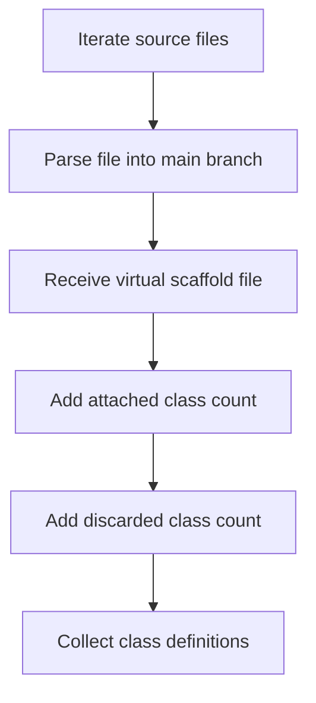
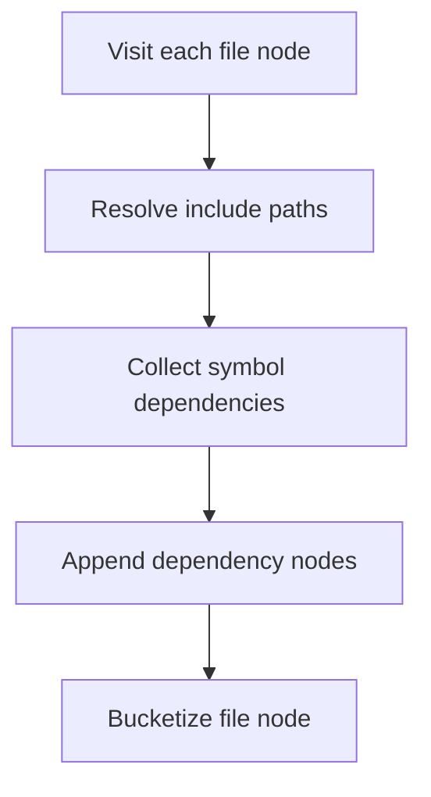
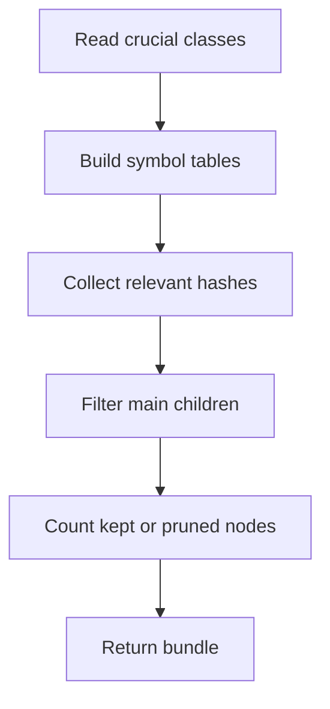
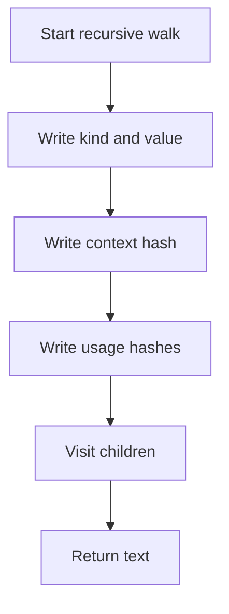
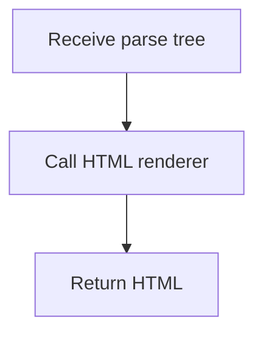

# core.cpp

- Source: `Microservice/Modules/Source/SyntacticBrokenAST/ParseTree/core.cpp`
- Kind: C++ implementation
- Role: actual parse-tree entrypoint for rooted source truth

## Folder Role
This file is the actual-branch entrypoint for `Trees/ClassGeneration/Actual/`.

## Quick Summary
This file owns the public parse-tree entrypoints. It creates the rooted `main_tree`, prepares per-file roots, calls the internal file parser, keeps the compatibility `shadow_tree`, and exposes text or HTML rendering helpers.

The actual branch is independent from `VirtualBroken/`. It records source truth even when a detached virtual-broken class candidate fails expected-structure verification.

## File-Level Flow
This diagram shows only how the functions in this file relate to each other. Detailed steps are kept inside each function section so the same behavior is not repeated twice.

## Function Map
- `build_cpp_parse_tree(source, context)` wraps an in-memory source string as a single file, then delegates to the file-list overload.
- `build_cpp_parse_tree(files, context)` builds the full bundle, then returns only `main_tree`.
- `build_cpp_parse_trees(files, context)` builds the full parse bundle with main, shadow, virtual scaffold, traces, dependency metadata, and report counters.
- `parse_tree_to_text(root)` walks a tree and emits an indented text view.
- `parse_tree_to_html(root)` delegates HTML rendering to the renderer module.

## build_cpp_parse_tree(source, context)
This overload does not parse directly. It adapts a raw source string into a `SourceFileUnit` named `<memory>` and then uses the file-list overload.

## build_cpp_parse_tree(files, context)
This overload keeps the public API small. It asks `build_cpp_parse_trees()` for the full bundle and returns the rooted actual tree only.

## build_cpp_parse_trees(files, context)
This is the real bundle builder in this file. It sets up roots, routes each file through the internal parser, records detached virtual-branch scaffold results, resolves dependencies, builds symbol relevance, and keeps the transitional shadow tree for downstream compatibility.

### Slice 1 - Root And File Setup
Quick summary: This slice prepares the bundle-level roots and per-file child nodes.
Why this is separate: root setup is structural bookkeeping; it happens before any file content is parsed.

### Slice 2 - Parse Files Into Actual Branch
Quick summary: This slice shows the file parsing loop and the class-local virtual scaffold counters.
Why this is separate: actual tree growth happens inside `parse_file_content_into_node()`, while this file only orchestrates the call and stores the results.

### Slice 3 - Enrich Actual File Nodes
Quick summary: This slice resolves cross-file context after all files have actual tree nodes.
Why this is separate: include dependencies and symbol dependencies require the file-level class-definition map built during parsing.

### Slice 4 - Build Transitional Shadow Tree
Quick summary: This slice keeps the older filtered shadow output alive for downstream consumers.
Why this is separate: this is compatibility behavior, not the same lifecycle as the detached virtual-broken scaffold.

## parse_tree_to_text(root)
This function renders one tree into an indented text representation. It recursively walks children, chooses the annotated display value when present, and prints hash metadata.

## parse_tree_to_html(root)
This function does not build HTML itself. It delegates to the HTML renderer with the fixed title `C++ Parse Tree`.

## Reading Boundaries
- Entry references outside this file: callers use the public parse-tree functions from `parse_tree.hpp`.
- Exit references outside this file: content parsing is delegated to `Internal/parse_tree_internal.hpp`, and HTML output is delegated to the tree renderer.
- Internal diagrams in this file should stay focused on the functions listed above.

## Acceptance Checks
- The file-level diagram shows function relationships only.
- Function diagrams describe local behavior using short intent labels, not generic action buckets.
- Detailed steps for `build_cpp_parse_trees()` appear only in that function section.
- Cross-file references appear only as entry or exit boundaries.
