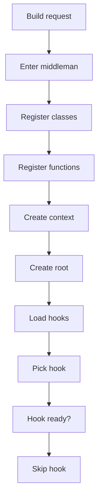
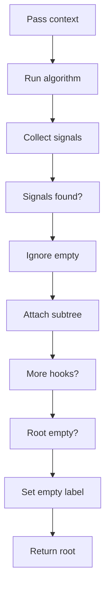
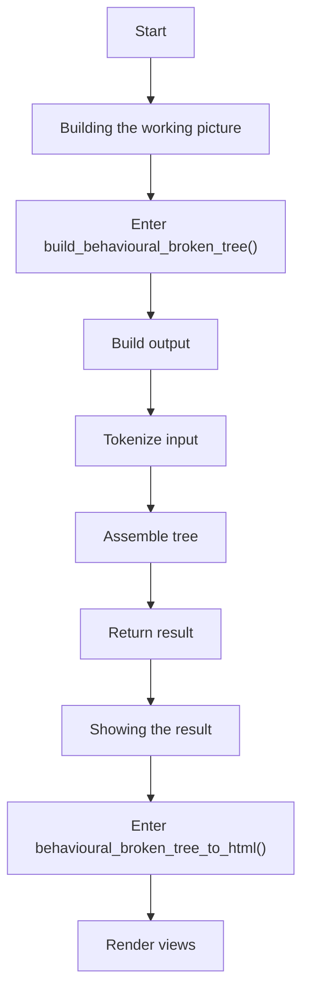
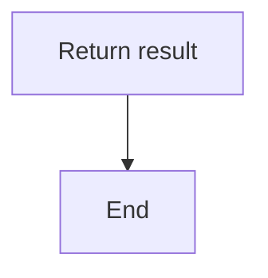
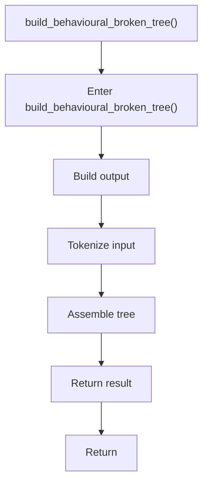
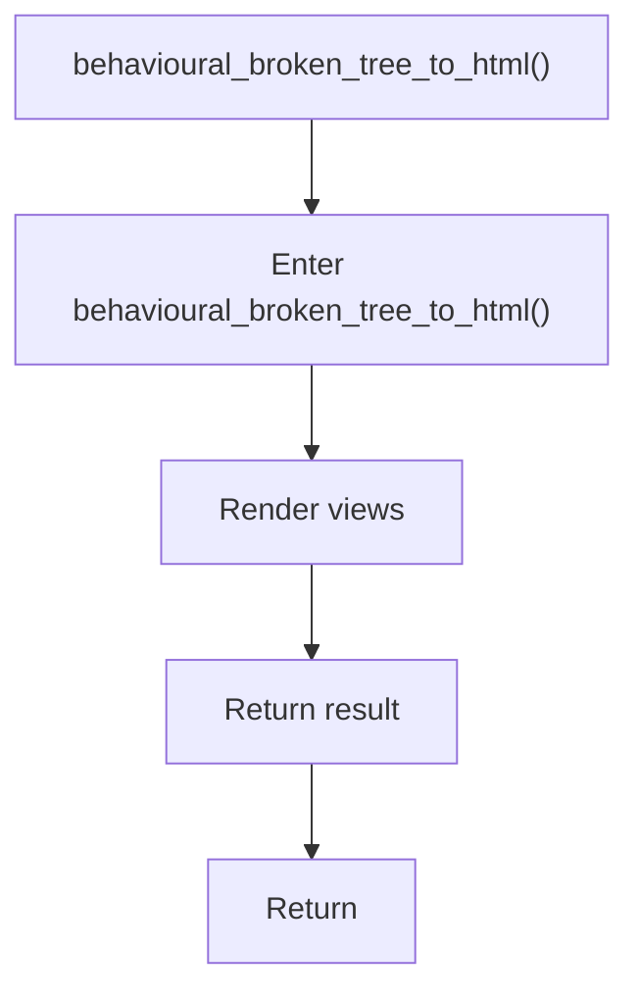

# behavioural_broken_tree.cpp

- Source: Microservice/Modules/Source/Behavioural/behavioural_broken_tree.cpp
- Kind: C++ implementation
- Lines: 91

## Story
### What Happens Here

This source file implements behavioural-pattern scaffolding or checks on top of the generic parse tree. It contributes one part of the behavioural broken-tree output by scanning for behavioural structure signals.

### Why It Matters In The Flow

Runs after the generic parse tree exists so behavioural scaffolds can classify pattern structure.

### What To Watch While Reading

Implements behavioural detection and structural verification scaffolds. The main surface area is easiest to track through symbols such as BehaviouralFunctionScaffoldDetector, BehaviouralStructureCheckerDetector, DefaultBehaviouralTreeCreator, and detect. It collaborates directly with behavioural_broken_tree.hpp, Logic/behavioural_logic_scaffold.hpp, Output-and-Rendering/tree_html_renderer.hpp, and utility.

## Required Middleman Flow
The desired design is that this file behaves as the behavioural middleman for tree assembly. Individual behavioural checks should not own repeated traversal, class registration, function registration, root assembly, or result attachment. They should expose only pattern-specific algorithms through virtual hooks or function-pointer style dispatch.

### Block 1 - Required Middleman Flow Details
#### Slice 1 - Opening Intent
Quick summary: This slice shows the opening intent of behavioural_broken_tree.cpp and the first major actions that frame the rest of the flow.
Why this is separate: behavioural_broken_tree.cpp has multiple branches, loops, or stage changes, so this section is split out to keep one major intent visible at a time instead of forcing one oversized diagram.

#### Slice 2 - Early Branches
Quick summary: This slice covers the first branch-heavy continuation of behavioural_broken_tree.cpp after the opening path has been established.
Why this is separate: behavioural_broken_tree.cpp has multiple branches, loops, or stage changes, so this section is split out to keep one major intent visible at a time instead of forcing one oversized diagram.

#### Slice 3 - Mid-Flow Handoff
Quick summary: This slice captures the mid-flow handoff in behavioural_broken_tree.cpp where preparation turns into deeper processing.
Why this is separate: behavioural_broken_tree.cpp has multiple branches, loops, or stage changes, so this section is split out to keep one major intent visible at a time instead of forcing one oversized diagram.

## Responsibility Split
- Middleman: class registration, function registration, shared context, traversal order, tree root, child attachment, empty output.
- Pattern hook: Strategy signals, Observer signals, scaffold checks, structure checks.
- Extension point: add a new hook without copying the assembly loop.

## Program Flow
This diagram follows the action path in plain words. Decision diamonds show where the file can stop, branch, or repeat work instead of simply passing through a straight line.

The flow is intentionally split into smaller slices so the major intent of behavioural_broken_tree.cpp stays readable. Each slice names the stage it is covering, gives a quick summary, and explains why that stage is separated from the next one.

### Program Flow Slices
#### Slice 1 - Opening Intent
Quick summary: This slice shows the opening intent of behavioural_broken_tree.cpp and the first major actions that frame the rest of the flow.
Why this is separate: behavioural_broken_tree.cpp has multiple branches, loops, or stage changes, so this section is split out to keep one major intent visible at a time instead of forcing one oversized diagram.

#### Slice 2 - Early Branches
Quick summary: This slice covers the first branch-heavy continuation of behavioural_broken_tree.cpp after the opening path has been established.
Why this is separate: behavioural_broken_tree.cpp has multiple branches, loops, or stage changes, so this section is split out to keep one major intent visible at a time instead of forcing one oversized diagram.

## Reading Map
Read this file as: Implements behavioural detection and structural verification scaffolds.

Where it sits in the run: Runs after the generic parse tree exists so behavioural scaffolds can classify pattern structure.

Names worth recognizing while reading: BehaviouralFunctionScaffoldDetector, BehaviouralStructureCheckerDetector, DefaultBehaviouralTreeCreator, detect, build_behavioural_function_scaffold, and build_behavioural_structure_checker.

It leans on nearby contracts or tools such as behavioural_broken_tree.hpp, Logic/behavioural_logic_scaffold.hpp, Output-and-Rendering/tree_html_renderer.hpp, utility, and vector.

## Story Groups

### Building The Working Picture
These steps assemble the trees, models, or bundles used by the rest of the file.
- build_behavioural_broken_tree() (line 61): Build or append the next output structure, parse or tokenize input text, and assemble tree or artifact structures

### Showing The Result
These steps turn internal state into text, HTML, JSON, or another output a reader can inspect.
- behavioural_broken_tree_to_html() (line 83): Render text or HTML views

## Function Stories

### build_behavioural_broken_tree()
This routine assembles a larger structure from the inputs it receives. It appears near line 61.

Inside the body, it mainly handles build or append the next output structure, parse or tokenize input text, and assemble tree or artifact structures.

The caller receives a computed result or status from this step.

What it does:
- build or append the next output structure
- parse or tokenize input text
- assemble tree or artifact structures

Flow:

### behavioural_broken_tree_to_html()
This routine owns one focused piece of the file's behavior. It appears near line 83.

Inside the body, it mainly handles render text or HTML views.

The caller receives a computed result or status from this step.

What it does:
- render text or HTML views

Flow:

## Documentation Note
- This markdown file is part of the generated docs/Codebase mirror.
- It was generated from the repository state on 2026-04-23 after reading the existing docs corpus and the current source tree.

