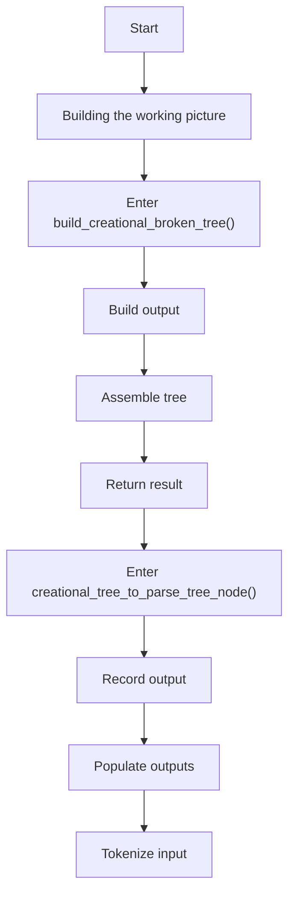
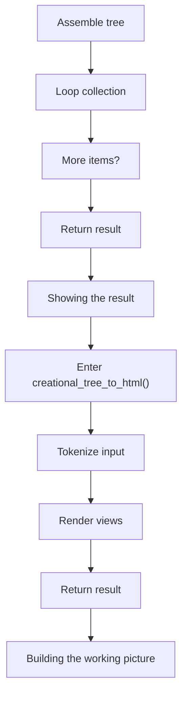
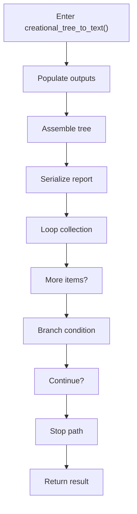

# creational_broken_tree_program_flow.cpp

- Source document: [creational_broken_tree.cpp.md](../creational_broken_tree.cpp.md)
- Purpose: decoupled implementation logic for a future code unit.

This diagram follows the action path in plain words. Decision diamonds show where the file can stop, branch, or repeat work instead of simply passing through a straight line.

The flow is intentionally split into smaller slices so the major intent of creational_broken_tree_program_flow.cpp stays readable. Each slice names the stage it is covering, gives a quick summary, and explains why that stage is separated from the next one.

### Program Flow Slices
#### Slice 1 - Opening Intent
Quick summary: This slice shows the opening intent of creational_broken_tree_program_flow.cpp and the first major actions that frame the rest of the flow.
Why this is separate: creational_broken_tree_program_flow.cpp has multiple branches, loops, or stage changes, so this section is split out to keep one major intent visible at a time instead of forcing one oversized diagram.

#### Slice 2 - Early Branches
Quick summary: This slice covers the first branch-heavy continuation of creational_broken_tree_program_flow.cpp after the opening path has been established.
Why this is separate: creational_broken_tree_program_flow.cpp has multiple branches, loops, or stage changes, so this section is split out to keep one major intent visible at a time instead of forcing one oversized diagram.

#### Slice 3 - Mid-Flow Handoff
Quick summary: This slice captures the mid-flow handoff in creational_broken_tree_program_flow.cpp where preparation turns into deeper processing.
Why this is separate: creational_broken_tree_program_flow.cpp has multiple branches, loops, or stage changes, so this section is split out to keep one major intent visible at a time instead of forcing one oversized diagram.

#### Slice 4 - Secondary Decision Path
Quick summary: This slice focuses on the next decision path in creational_broken_tree_program_flow.cpp and the outcomes that follow from it.
Why this is separate: creational_broken_tree_program_flow.cpp has multiple branches, loops, or stage changes, so this section is split out to keep one major intent visible at a time instead of forcing one oversized diagram.

