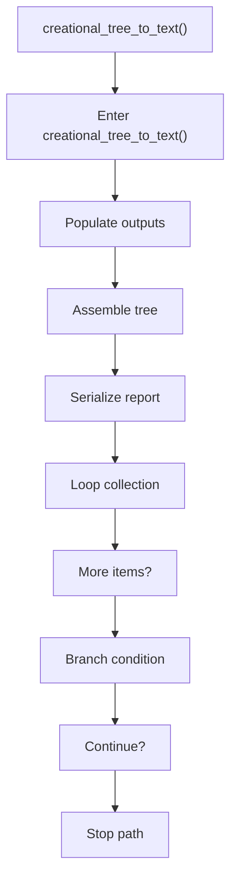
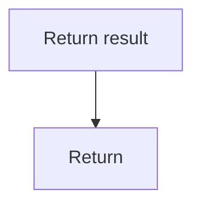

# creational_tree_to_text.cpp

- Source document: [creational_broken_tree.cpp.md](../../creational_broken_tree.cpp.md)
- Purpose: decoupled implementation logic for a future code unit.

### creational_tree_to_text()
This routine owns one focused piece of the file's behavior. It appears near line 121.

Inside the body, it mainly handles populate output fields or accumulators, assemble tree or artifact structures, serialize report content, and iterate over the active collection.

The implementation iterates over a collection or repeated workload. It branches on runtime conditions instead of following one fixed path. The caller receives a computed result or status from this step.

What it does:
- populate output fields or accumulators
- assemble tree or artifact structures
- serialize report content
- iterate over the active collection
- branch on runtime conditions

Flow:

### Block 3 - creational_tree_to_text() Details
#### Slice 1 - Opening Intent
Quick summary: This slice shows the opening intent of creational_tree_to_text.cpp and the first major actions that frame the rest of the flow.
Why this is separate: creational_tree_to_text.cpp has multiple branches, loops, or stage changes, so this section is split out to keep one major intent visible at a time instead of forcing one oversized diagram.

#### Slice 2 - Early Branches
Quick summary: This slice covers the first branch-heavy continuation of creational_tree_to_text.cpp after the opening path has been established.
Why this is separate: creational_tree_to_text.cpp has multiple branches, loops, or stage changes, so this section is split out to keep one major intent visible at a time instead of forcing one oversized diagram.

