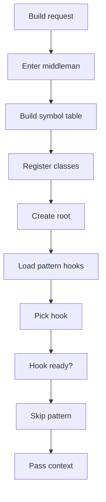
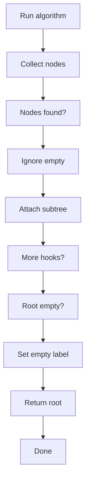

# creational_broken_tree.cpp

- Source: Microservice/Modules/Source/Creational/creational_broken_tree.cpp
- Kind: C++ implementation
- Lines: 143

## Story
### What Happens Here

This source file implements creational-pattern analysis over the generic parse tree. It inspects parsed structure, applies pattern-specific rules, and emits detector results that later appear in the creational tree or documentation tags.

### Why It Matters In The Flow

Runs after the generic parse tree exists so creational detection can label the structure.

### What To Watch While Reading

Implements creational pattern detection over the generic parse tree. The main surface area is easiest to track through symbols such as FactoryPatternDetector, SingletonPatternDetector, BuilderPatternDetector, and DefaultCreationalTreeCreator. It collaborates directly with creational_broken_tree.hpp, Builder/builder_pattern_logic.hpp, Factory/factory_pattern_logic.hpp, and Singleton/singleton_pattern_logic.hpp.

## Required Middleman Flow
The desired design is that this file behaves as the creational middleman for tree assembly. Individual pattern files should not own the repeated work of class registration, shared context setup, family-root assembly, or result attachment. They should expose only pattern-specific algorithms through virtual hooks or function-pointer style dispatch.

### Block 1 - Required Middleman Flow Details
#### Slice 1 - Opening Intent
Quick summary: This slice shows the opening intent of creational_broken_tree.cpp and the first major actions that frame the rest of the flow.
Why this is separate: creational_broken_tree.cpp has multiple branches, loops, or stage changes, so this section is split out to keep one major intent visible at a time instead of forcing one oversized diagram.

#### Slice 2 - Early Branches
Quick summary: This slice covers the first branch-heavy continuation of creational_broken_tree.cpp after the opening path has been established.
Why this is separate: creational_broken_tree.cpp has multiple branches, loops, or stage changes, so this section is split out to keep one major intent visible at a time instead of forcing one oversized diagram.

## Responsibility Split
- Middleman: class registration, shared symbol tables, traversal order, tree root, child attachment, empty output.
- Pattern hook: Factory return checks, Singleton accessor checks, Builder chain checks.
- Extension point: add a new hook without copying the assembly loop.

## Program Flow
Detailed program flow is decoupled into future implementation units:

- [program_flow](./creational_broken_tree/creational_broken_tree_program_flow.cpp.md)
## Reading Map
Read this file as: Implements creational pattern detection over the generic parse tree.

Where it sits in the run: Runs after the generic parse tree exists so creational detection can label the structure.

Names worth recognizing while reading: FactoryPatternDetector, SingletonPatternDetector, BuilderPatternDetector, DefaultCreationalTreeCreator, detect, and build_factory_pattern_tree.

It leans on nearby contracts or tools such as creational_broken_tree.hpp, Builder/builder_pattern_logic.hpp, Factory/factory_pattern_logic.hpp, Singleton/singleton_pattern_logic.hpp, Output-and-Rendering/tree_html_renderer.hpp, and functional.

## Story Groups

### Building The Working Picture
These steps assemble the trees, models, or bundles used by the rest of the file.
- build_creational_broken_tree() (line 74): Build or append the next output structure and assemble tree or artifact structures
- creational_tree_to_parse_tree_node() (line 98): Record derived output into collections, populate output fields or accumulators, and parse or tokenize input text
- creational_tree_to_text() (line 121): Populate output fields or accumulators, assemble tree or artifact structures, and serialize report content

### Showing The Result
These steps turn internal state into text, HTML, JSON, or another output a reader can inspect.
- creational_tree_to_html() (line 112): Parse or tokenize input text and render text or HTML views

## Function Stories
Function-level logic is decoupled into future implementation units:

- [build_creational_broken_tree](./creational_broken_tree/functions/build_creational_broken_tree.cpp.md)
- [creational_tree_to_parse_tree_node](./creational_broken_tree/functions/creational_tree_to_parse_tree_node.cpp.md)
- [creational_tree_to_html](./creational_broken_tree/functions/creational_tree_to_html.cpp.md)
- [creational_tree_to_text](./creational_broken_tree/functions/creational_tree_to_text.cpp.md)
## Documentation Note
- This markdown file is part of the generated docs/Codebase mirror.
- It was generated from the repository state on 2026-04-23 after reading the existing docs corpus and the current source tree.
