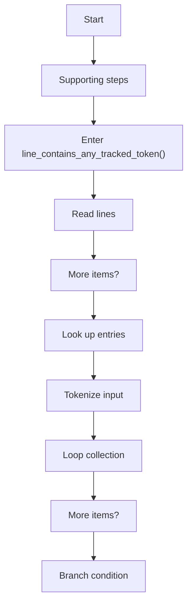
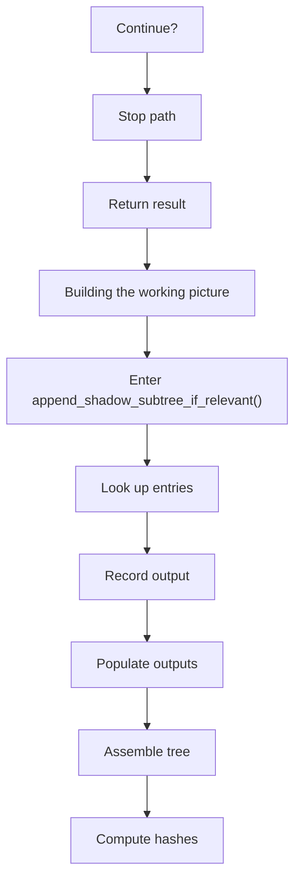
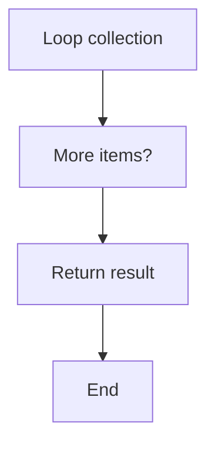
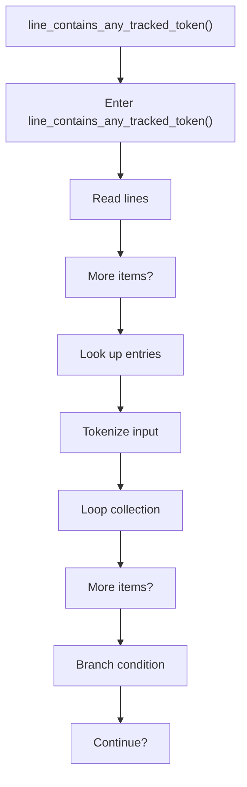
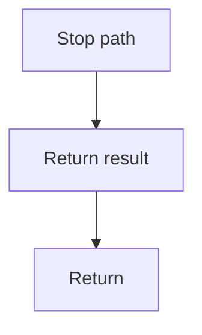
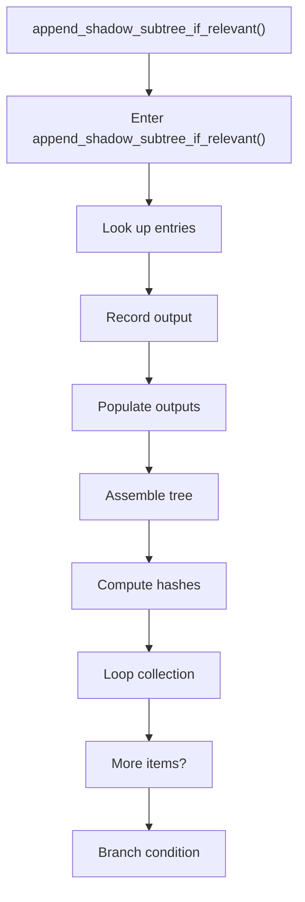
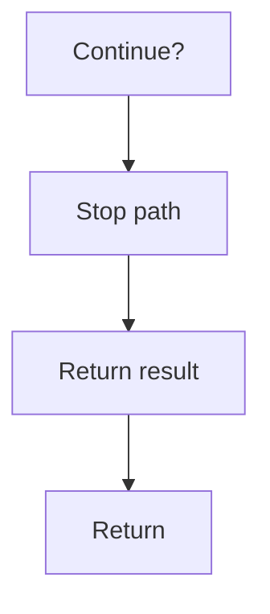

# relevance.cpp

- Source: Microservice/Modules/Source/ParseTree/Internal/relevance.cpp
- Kind: C++ implementation
- Lines: 108

## Story
### What Happens Here

This source file implements one internal part of the generic parse-tree engine. It contributes specialized behavior such as dependency handling, symbolization, hash-link construction, rendering, or older generation helpers after the raw tree exists. This source file implements one of the generic middle-stage services in the C++ pipeline. It is executed after sources are loaded and before the final report and rendered outputs are written.

### Why It Matters In The Flow

Runs across the middle of the microservice flow to build parse trees, hash links, symbol tables, documentation tags, reports, and rendered outputs.

### What To Watch While Reading

Implements parsing, shadow-tree building, symbolization, hash linking, rendering, and reporting. The main surface area is easiest to track through symbols such as line_contains_any_tracked_token and append_shadow_subtree_if_relevant. It collaborates directly with Internal/parse_tree_internal.hpp, string, unordered_set, and utility.

## Program Flow
This diagram follows the action path in plain words. Decision diamonds show where the file can stop, branch, or repeat work instead of simply passing through a straight line.

The flow is intentionally split into smaller slices so the major intent of relevance.cpp stays readable. Each slice names the stage it is covering, gives a quick summary, and explains why that stage is separated from the next one.

### Program Flow Slices
#### Slice 1 - Opening Intent
Quick summary: This slice shows the opening intent of relevance.cpp and the first major actions that frame the rest of the flow.
Why this is separate: relevance.cpp has multiple branches, loops, or stage changes, so this section is split out to keep one major intent visible at a time instead of forcing one oversized diagram.

#### Slice 2 - Early Branches
Quick summary: This slice covers the first branch-heavy continuation of relevance.cpp after the opening path has been established.
Why this is separate: relevance.cpp has multiple branches, loops, or stage changes, so this section is split out to keep one major intent visible at a time instead of forcing one oversized diagram.

#### Slice 3 - Mid-Flow Handoff
Quick summary: This slice captures the mid-flow handoff in relevance.cpp where preparation turns into deeper processing.
Why this is separate: relevance.cpp has multiple branches, loops, or stage changes, so this section is split out to keep one major intent visible at a time instead of forcing one oversized diagram.

## Reading Map
Read this file as: Implements parsing, shadow-tree building, symbolization, hash linking, rendering, and reporting.

Where it sits in the run: Runs across the middle of the microservice flow to build parse trees, hash links, symbol tables, documentation tags, reports, and rendered outputs.

Names worth recognizing while reading: line_contains_any_tracked_token and append_shadow_subtree_if_relevant.

It leans on nearby contracts or tools such as Internal/parse_tree_internal.hpp, string, unordered_set, utility, and vector.

## Story Groups

### Building The Working Picture
These steps assemble the trees, models, or bundles used by the rest of the file.
- append_shadow_subtree_if_relevant() (line 29): Look up entries in previously collected maps or sets, record derived output into collections, and populate output fields or accumulators

### Supporting Steps
These steps support the local behavior of the file.
- line_contains_any_tracked_token() (line 10): Work one source line at a time, look up entries in previously collected maps or sets, and parse or tokenize input text

## Function Stories

### line_contains_any_tracked_token()
This routine owns one focused piece of the file's behavior. It appears near line 10.

Inside the body, it mainly handles work one source line at a time, look up entries in previously collected maps or sets, parse or tokenize input text, and iterate over the active collection.

The implementation iterates over a collection or repeated workload. It branches on runtime conditions instead of following one fixed path. The caller receives a computed result or status from this step.

What it does:
- work one source line at a time
- look up entries in previously collected maps or sets
- parse or tokenize input text
- iterate over the active collection
- branch on runtime conditions

Flow:

### Block 2 - line_contains_any_tracked_token() Details
#### Slice 1 - Opening Intent
Quick summary: This slice shows the opening intent of relevance.cpp and the first major actions that frame the rest of the flow.
Why this is separate: relevance.cpp has multiple branches, loops, or stage changes, so this section is split out to keep one major intent visible at a time instead of forcing one oversized diagram.

#### Slice 2 - Early Branches
Quick summary: This slice covers the first branch-heavy continuation of relevance.cpp after the opening path has been established.
Why this is separate: relevance.cpp has multiple branches, loops, or stage changes, so this section is split out to keep one major intent visible at a time instead of forcing one oversized diagram.

### append_shadow_subtree_if_relevant()
This helper reshapes small pieces of data so the surrounding code can stay readable. It appears near line 29.

Inside the body, it mainly handles look up entries in previously collected maps or sets, record derived output into collections, populate output fields or accumulators, and assemble tree or artifact structures.

The implementation iterates over a collection or repeated workload. It branches on runtime conditions instead of following one fixed path. The caller receives a computed result or status from this step.

What it does:
- look up entries in previously collected maps or sets
- record derived output into collections
- populate output fields or accumulators
- assemble tree or artifact structures
- compute hash metadata
- iterate over the active collection
- branch on runtime conditions

Flow:

### Block 3 - append_shadow_subtree_if_relevant() Details
#### Slice 1 - Opening Intent
Quick summary: This slice shows the opening intent of relevance.cpp and the first major actions that frame the rest of the flow.
Why this is separate: relevance.cpp has multiple branches, loops, or stage changes, so this section is split out to keep one major intent visible at a time instead of forcing one oversized diagram.

#### Slice 2 - Early Branches
Quick summary: This slice covers the first branch-heavy continuation of relevance.cpp after the opening path has been established.
Why this is separate: relevance.cpp has multiple branches, loops, or stage changes, so this section is split out to keep one major intent visible at a time instead of forcing one oversized diagram.

## Documentation Note
- This markdown file is part of the generated docs/Codebase mirror.
- It was generated from the repository state on 2026-04-23 after reading the existing docs corpus and the current source tree.

