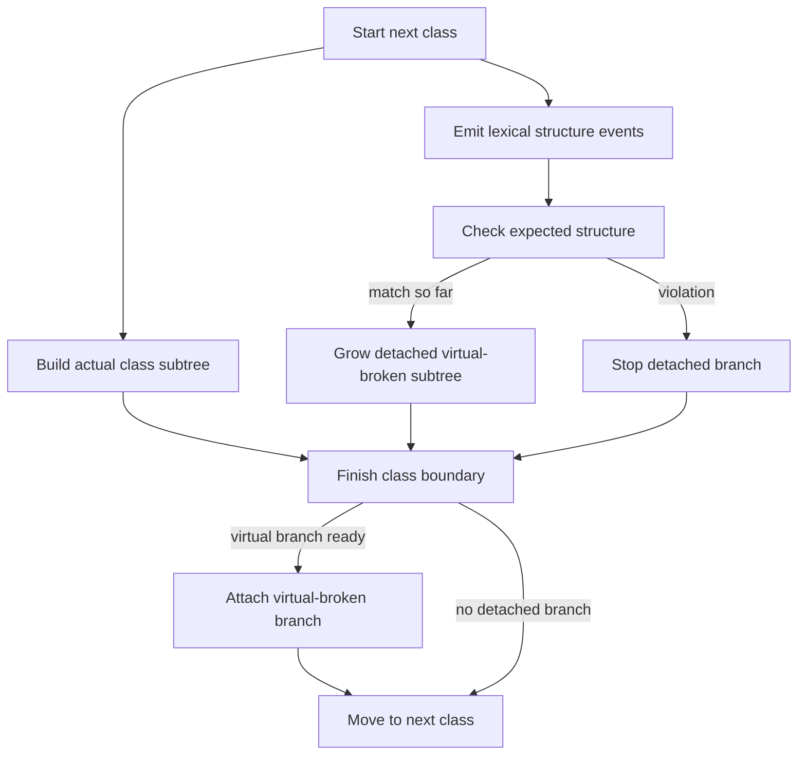

# `core.cpp`

- Folder: `docs/Codebase/Microservice/Modules/Source/Trees/ClassGeneration`
- Role: stage workflow for simultaneous actual and virtual-broken generation at class scope

## Start Here
- Read this file first if you want the per-class lifecycle before dropping into actual, virtual-broken, or attachment details.

## Quick Summary
- Class generation happens one class at a time.
- While the parser builds the actual subtree, lexical verification independently decides whether a detached virtual-broken subtree is still allowed to grow for the same class.
- The detached virtual-broken subtree is attached only if the class still matches the expected structure when generation finishes.

## Why This Folder Is Separate
- `MainTree/` explains ownership under the root.
- `ClassGeneration/` explains the live generation lifecycle for one class.
- `Attachment/` is separated because attach-or-discard is the final gate after both branches are built.

## Major Workflow

## Lifecycle Rules
- The generation unit is one class, not one whole file-sized temporary branch.
- Actual generation and virtual-broken generation run in parallel for the same class.
- The expected-structure check is driven by lexical events, not by the actual subtree.
- The actual class subtree continues because it records real source structure even when the virtual-broken subtree fails validation.
- A validation failure stops virtual-broken generation for that class only.
- After failure, the system waits for the actual branch to progress to the next class before starting a new detached virtual-broken branch.

## Local Ownership
- `Actual/` owns the literal class declaration and implementation structure.
- `VirtualBroken/` owns the strict expected-pattern structure for the same class.
- `Attachment/` owns the last decision to attach or release the detached branch.

## Acceptance Checks
- The docs say actual and virtual-broken generation happen simultaneously.
- The docs say the virtual-broken lifecycle is per class.
- The docs do not show the actual subtree as an input into expected-structure checking.
- The docs say failure stops only the detached branch for that class.
