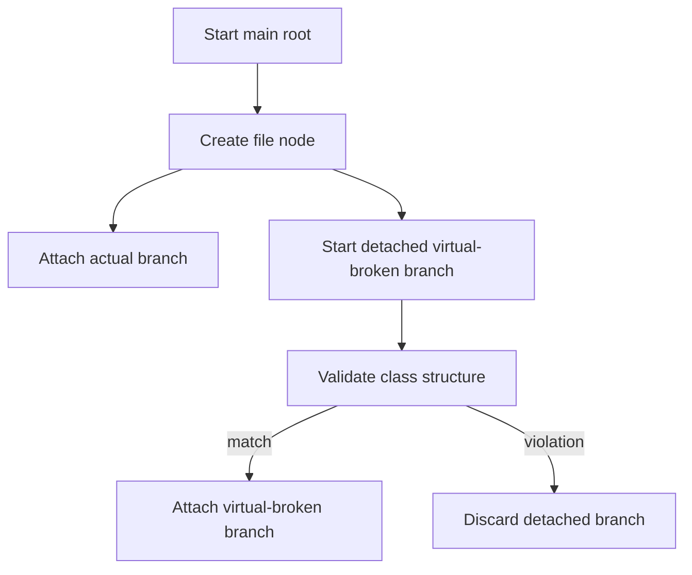

# `core.cpp`

- Folder: `docs/Codebase/Microservice/Modules/Source/Trees/MainTree`
- Role: ownership map for the main tree root and the file-level branches attached under it

## Start Here
- Read this file first if you want to understand where the actual branch lives, where the virtual-broken branch lives, and when each one is allowed to attach.

## Quick Summary
- The main tree has one entry root.
- Each direct child of that root is a file node.
- Each file node owns an actual parse-tree branch and may later gain a virtual-broken branch for classes that passed strict structure validation.

## Why This Folder Is Separate
- The rooted ownership model is different from class-level generation.
- `MainTree/` explains where branches are allowed to exist.
- `ClassGeneration/` explains how those branches are built and validated.

## Major Workflow

## Structure Rules
- Root direct children are file nodes.
- Under each file node, the actual parse-tree path is part of the main tree as soon as generation begins.
- Class declaration and class implementation distinctions can appear in both actual and virtual-broken branches.
- The virtual-broken branch is not attached to the file node while its class is still under validation.
- The virtual-broken branch attaches only after both actual and virtual-broken generation for that class are complete and the structure still matches expectations.
- The class registry must point to subtree heads, not duplicate tree content. After a class is accepted, its registry record should be able to reference both the actual subtree head and the attached virtual-broken subtree head.

## Attachment Rules
- Actual branch: attached immediately because it records the literal source structure.
- Virtual-broken branch: detached during generation because it is provisional and may be discarded.
- On violation: release the detached branch and continue with the next class while the actual branch stays intact.
- On match: attach the finished virtual-broken branch under the same file node.
- On match, update or finalize the class registry record so the `std::hash`-derived class key can resolve back to the actual and virtual subtree heads.

## Acceptance Checks
- The docs show one entry root with file nodes as direct children.
- The actual branch is always described as rooted early.
- The virtual-broken branch is always described as detached until validation success.
- The registry pointer target is described as subtree heads for actual and virtual branches.
