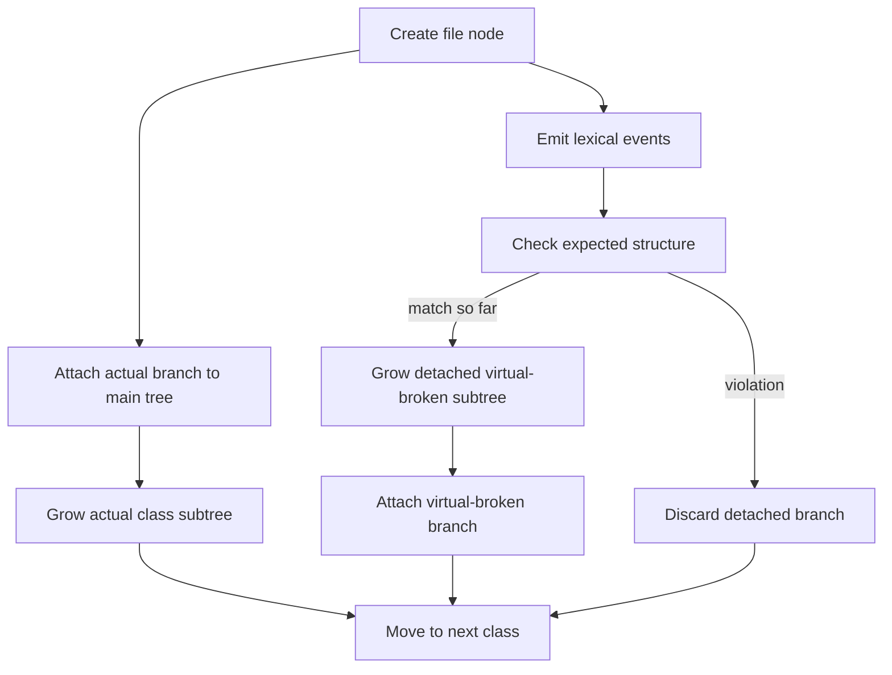

# `core.cpp`

- Folder: `docs/Codebase/Microservice/Modules/Source/Trees`
- Role: stage-wide workflow for rooted tree ownership and simultaneous per-class actual plus virtual-broken generation

## Start Here
- Read this file first for the tree-stage workflow.
- Then read `MainTree/`, `ClassGeneration/`, and `Shared/` in that order.

## Quick Summary
- This stage creates one rooted tree model with file nodes at the top.
- For each class, it builds the actual parse subtree and a detached virtual-broken subtree at the same time.
- The actual subtree is rooted immediately, while lexical verification independently decides whether the detached virtual-broken subtree can survive long enough to attach.

## Why This Stage Is Separate
- `Analysis/` decides structure and usage meaning.
- `Trees/` materializes the rooted branches and class-level subtrees from that structural understanding.
- `HashingMechanism/` gives those tree nodes propagated identity and reconnectable lookup paths.
- `Diffing/` asks this stage to locate and regenerate only affected subtrees.

## Major Workflow

## Handoff
- Receives structural context from `../Analysis/core.cpp.md`.
- Hands to `../HashingMechanism/core.cpp.md` when tree nodes need reverse-Merkle identity and hash-link lookup.
- Serves `../Diffing/core.cpp.md` by exposing affected actual subtree boundaries and virtual-broken equivalents.

## Local Ownership
- `MainTree/` owns root and file-node attachment rules.
- `ClassGeneration/` owns simultaneous per-class generation.
- `ClassGeneration/Actual/` owns the literal class subtree that stays rooted in the main tree.
- `ClassGeneration/VirtualBroken/` owns the detached strict-structure branch.
- `ClassGeneration/Attachment/` owns the final attach-or-discard decision.
- `Shared/` owns helpers used by more than one tree subtype.

## Acceptance Checks
- The docs say virtual copy and broken AST are the same branch.
- The docs say actual and virtual-broken generation happen simultaneously per class.
- The docs do not imply that actual-tree growth is downstream of expected-structure checking.
- The docs say the virtual-broken branch is detached during generation and attached only on success.
- Shared helpers stay inside `Shared/`.
- Tree construction is readable as one stage-level workflow.
