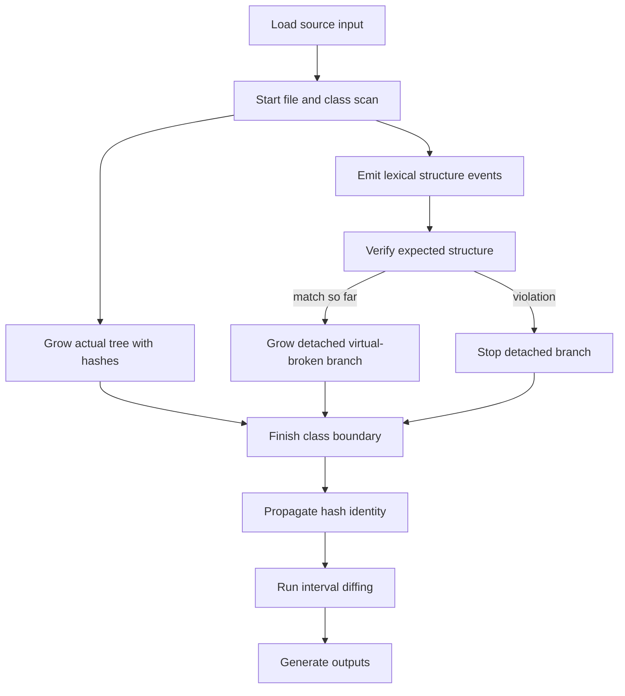
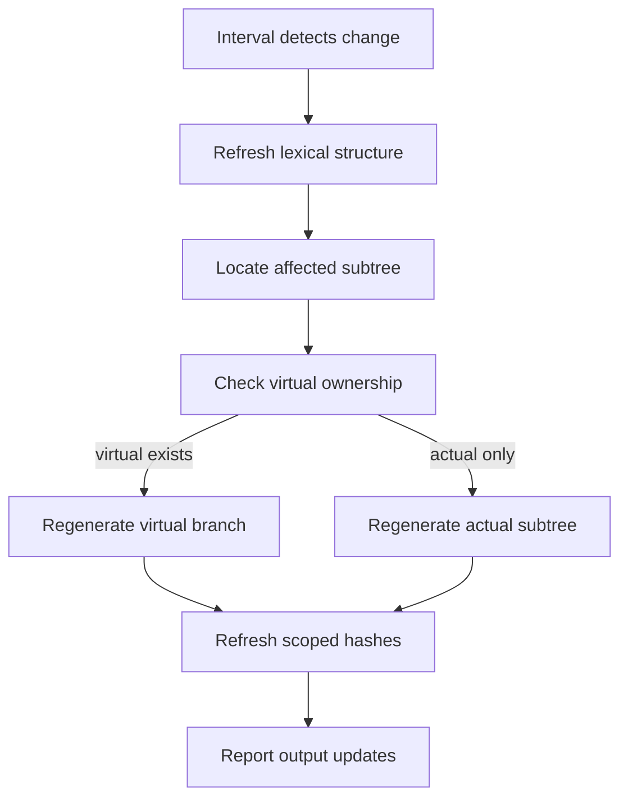

# main.cpp

- Folder: `docs/Codebase/Microservice/Modules/Source`
- Role: top-level conceptual entrypoint for the source-side analysis pipeline

## Start Here
This is the first file to read when you want the whole source-side flow before diving into any local folder.

## Main Intent
This subsystem reads source input, performs structural and lexical analysis, builds the rooted actual parse tree while simultaneously shaping a detached virtual-broken branch per class, propagates hash identity, resolves implementation use back to declarations, supports interval diffing for partial subtree regeneration, runs pattern analysis, and emits unit-test-ready and documentation-ready outputs.

## Reading Order
1. `Analysis/core.cpp.md`
2. `Trees/core.cpp.md`
3. `HashingMechanism/core.cpp.md`
4. `Diffing/core.cpp.md`
5. `OutputGeneration/core.cpp.md`

## Runtime Shape
`Analysis/`, `Trees/`, and `HashingMechanism/` are separate documentation ownership folders, but their core runtime work overlaps during the per-file and per-class scan. `Diffing/` is a later interval-checking subsystem that reuses those stages to locate affected subtrees, regenerate only changed structural regions, and refresh hashes before output updates.

## Major Handoffs
- `Analysis/` identifies structure, usage context, and pattern-relevant signals.
- `Trees/` roots the actual branch under file nodes and manages simultaneous per-class virtual-broken generation with attach-or-discard rules.
- `HashingMechanism/` gives those structures stable cascading identities and lookup paths.
- `Diffing/` re-runs lexical structural analysis on changed regions, locates affected actual subtrees, compares virtual and actual equivalents, and returns partial regeneration plans.
- `OutputGeneration/` converts the analyzed bundle into tests, tags, reports, and rendered outputs.

## Flow

## Interval Diffing Flow
This flow runs after the initial tree state exists. It keeps regeneration scoped to affected subtrees.

## Jump Directly To
- `Analysis/core.cpp.md` if you only want lexical, binding, or pattern logic
- `Trees/core.cpp.md` if you only want rooted tree ownership and simultaneous actual plus virtual-broken generation
- `HashingMechanism/core.cpp.md` if you only want reverse-Merkle and hash-link lookup
- `Diffing/core.cpp.md` if you only want interval checking and partial regeneration planning
- `OutputGeneration/core.cpp.md` if you only want tests, tags, reports, or render outputs

## Acceptance Checks
- the whole source subsystem can be understood from this file before entering subfolders
- each later folder is a handoff stage, not a hidden top-level entrypoint
