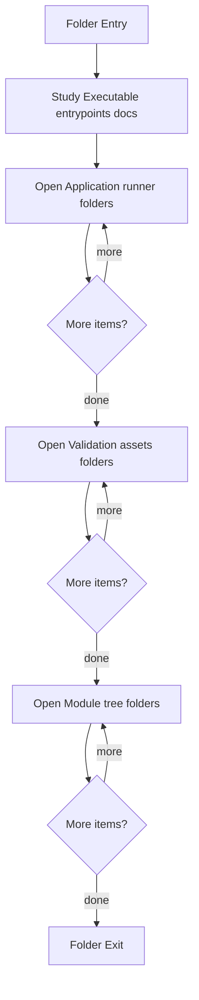

# Microservice

- Folder: docs/Codebase/Microservice
- Descendant source docs: 99
- Generated on: 2026-04-23

## Logic Summary
C++ executable and module tree that implement the parser, detector, documentation tagging, rendering, and report pipeline.

## Subsystem Story
This folder mixes concrete local documents with deeper child subsystems. Read the local docs to understand the visible behavior first, then descend into the child folders for the lower-level detail that supports it.

## Folder Flow

## Child Folders By Logic
### Runtime
These child folders continue the subsystem by covering application runtime orchestration around the deeper module code.
- Runtime/ : CLI validation, file discovery, pipeline execution, diagnostics, and output writing.

### Validation Assets
These child folders continue the subsystem by covering Validation-oriented source corpus and test support assets.
- Test/ : Validation-oriented source corpus and test support assets.

### Module Tree
These child folders continue the subsystem by covering Modularized C++ implementation divided into compile-time headers and source implementations.
- Modules/ : Modularized C++ implementation divided into compile-time headers and source implementations.

## Documents By Logic
### Executable Entrypoints
These documents explain the local implementation by covering Thin executable entrypoint that delegates to the syntactic broken AST runner.
- main.cpp.md : Thin executable entrypoint that delegates to the syntactic broken AST runner.

## Reading Hint
- Read the local file docs first for concrete behavior, then descend into the child folders for narrower subsystem details.

