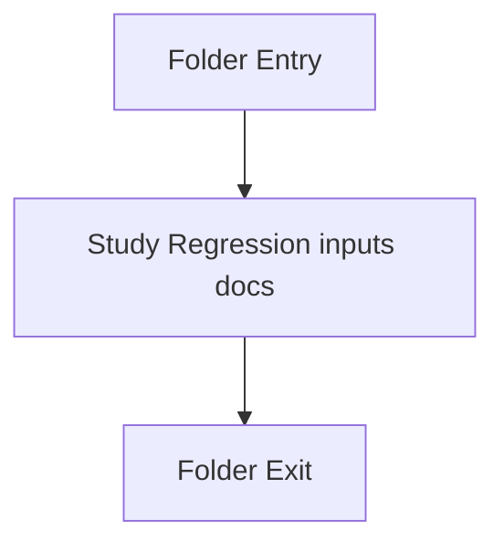

# Input

- Folder: docs/Codebase/Microservice/Test/Input
- Descendant source docs: 5
- Generated on: 2026-04-23

## Logic Summary
Regression-focused input programs used to exercise specific transform and detection routes.

## Subsystem Story
This folder is mostly leaf-level. The local documents here carry the main explanation of the subsystem without requiring much extra descent.

## Folder Flow

## Documents By Logic
### Regression Inputs
These documents explain the local implementation by covering Supplies regression-style sample programs for microservice analysis routes..
- factory_to_base_identifier_literal_source.cpp.md : Supplies regression-style sample programs for microservice analysis routes.
- factory_to_base_instance_source.cpp.md : Supplies regression-style sample programs for microservice analysis routes.
- factory_to_base_kind_numeric_source.cpp.md : Supplies regression-style sample programs for microservice analysis routes.
- factory_to_base_non_literal_source.cpp.md : Supplies regression-style sample programs for microservice analysis routes.
- factory_to_base_unresolved_instance_source.cpp.md : Supplies regression-style sample programs for microservice analysis routes.

## Reading Hint
- This folder is mostly leaf-level. Read the local file docs to understand the logic in this area.

