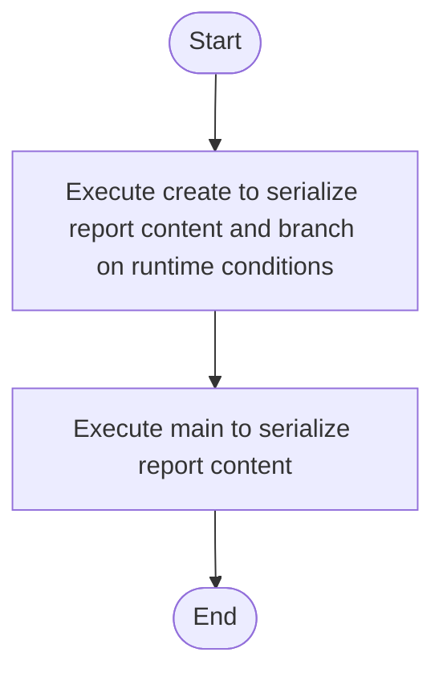

# factory_to_base_non_literal_source.cpp

- Source: Microservice/Test/Input/factory_to_base_non_literal_source.cpp
- Kind: C++ implementation
- Lines: 42
- Role: Supplies regression-style sample programs for microservice analysis routes.
- Chronology: These files are consumed as regression corpus input during validation scenarios.

## Notable Symbols
- Report
- JsonReport
- CsvReport
- ReportFactory
- create
- main

## Direct Dependencies
- memory
- string

## File Outline
### Responsibility

This file implements a regression corpus case for the microservice. Its code is not part of the executable itself; instead, it is analyzed so the pipeline can prove that specific pattern transitions or edge cases are handled correctly.

### Position In The Flow

These files are consumed as regression corpus input during validation scenarios.

### Main Surface Area

Supplies regression-style sample programs for microservice analysis routes. The main surface area is easiest to track through symbols such as Report, JsonReport, CsvReport, and ReportFactory. It collaborates directly with memory and string.

## File Activity


## Function Walkthrough

### create
This routine assembles a larger structure from the inputs it receives. It appears near line 20.

Inside the body, it mainly handles serialize report content and branch on runtime conditions.

It branches on runtime conditions instead of following one fixed path. The caller receives a computed result or status from this step.

Key operations:
- serialize report content
- branch on runtime conditions

Activity:
```mermaid
flowchart TD
    Start([create()])
    N0[Enter create()]
    N1[Serialize report content]
    N2[Branch on runtime conditions]
    N3[Return the result to the caller]
    End([Return])
    Start --> N0
    N0 --> N1
    N1 --> N2
    N2 --> N3
    N3 --> End
```

### main
This routine owns one focused piece of the file's behavior. It appears near line 34.

Inside the body, it mainly handles serialize report content.

The caller receives a computed result or status from this step.

Key operations:
- serialize report content

Activity:
```mermaid
flowchart TD
    Start([main()])
    N0[Enter main()]
    N1[Serialize report content]
    N2[Return the result to the caller]
    End([Return])
    Start --> N0
    N0 --> N1
    N1 --> N2
    N2 --> End
```

## Documentation Note
- This markdown file is part of the generated docs/Codebase mirror.
- It was generated from the repository state on 2026-04-23 after reading the existing docs corpus and the current source tree.

