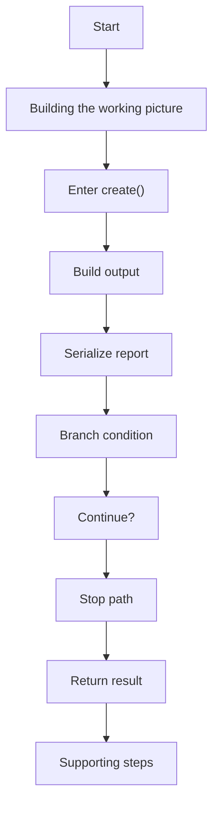
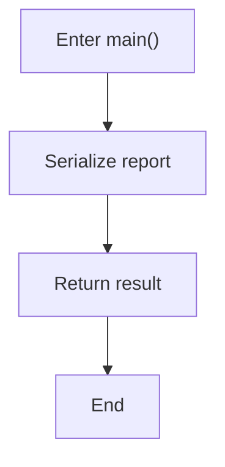
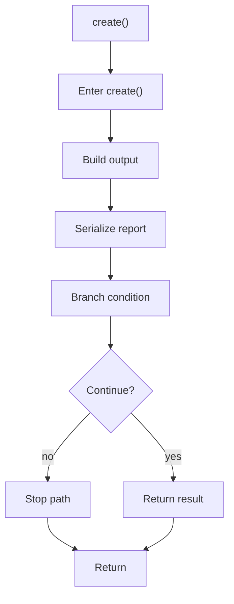
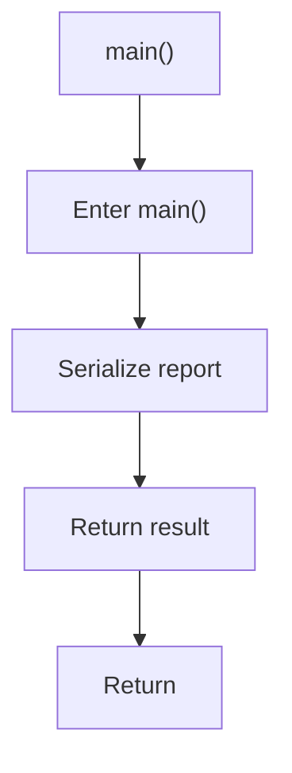

# factory_to_base_unresolved_instance_source.cpp

- Source: Microservice/Test/Input/factory_to_base_unresolved_instance_source.cpp
- Kind: C++ implementation
- Lines: 33

## Story
### What Happens Here

This file implements a regression corpus case for the microservice. Its code is not part of the executable itself; instead, it is analyzed so the pipeline can prove that specific pattern evidence or edge cases are tagged correctly.

### Why It Matters In The Flow

These files are consumed as regression corpus input during validation scenarios.

### What To Watch While Reading

Supplies regression-style sample programs for microservice analysis routes. The main surface area is easiest to track through symbols such as Report, JsonReport, ReportFactory, and create. It collaborates directly with memory and string.

## Program Flow
This diagram follows the action path in plain words. Decision diamonds show where the file can stop, branch, or repeat work instead of simply passing through a straight line.

### Block 1 - Program Flow Details
#### Part 1

#### Part 2

## Reading Map
Read this file as: Supplies regression-style sample programs for microservice analysis routes.

Where it sits in the run: These files are consumed as regression corpus input during validation scenarios.

Names worth recognizing while reading: Report, JsonReport, ReportFactory, create, and main.

It leans on nearby contracts or tools such as memory and string.

## Story Groups

### Building The Working Picture
These steps assemble the trees, models, or bundles used by the rest of the file.
- create() (line 17): Build or append the next output structure, serialize report content, and branch on runtime conditions

### Supporting Steps
These steps support the local behavior of the file.
- main() (line 26): Serialize report content

## Function Stories

### create()
This routine assembles a larger structure from the inputs it receives. It appears near line 17.

Inside the body, it mainly handles build or append the next output structure, serialize report content, and branch on runtime conditions.

It branches on runtime conditions instead of following one fixed path. The caller receives a computed result or status from this step.

What it does:
- build or append the next output structure
- serialize report content
- branch on runtime conditions

Flow:

### main()
This routine owns one focused piece of the file's behavior. It appears near line 26.

Inside the body, it mainly handles serialize report content.

The caller receives a computed result or status from this step.

What it does:
- serialize report content

Flow:

## Documentation Note
- This markdown file is part of the generated docs/Codebase mirror.
- It was generated from the repository state on 2026-04-23 after reading the existing docs corpus and the current source tree.
