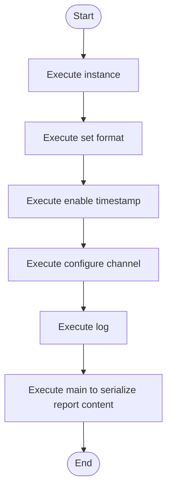

# singleton_to_builder_source.cpp

- Source: Microservice/Test/Input/singleton_to_builder_source.cpp
- Kind: C++ implementation
- Lines: 36
- Role: Supplies regression-style sample programs for microservice analysis routes.
- Chronology: These files are consumed as regression corpus input during validation scenarios.

## Notable Symbols
- ReportService
- instance
- set_format
- enable_timestamp
- configure_channel
- log
- main

## Direct Dependencies
- iostream
- string

## Implementation Story
This file implements a regression corpus case for the microservice. Its code is not part of the executable itself; instead, it is analyzed so the pipeline can prove that specific pattern transitions or edge cases are handled correctly. Supplies regression-style sample programs for microservice analysis routes. These files are consumed as regression corpus input during validation scenarios. The implementation surface is easiest to recognize through symbols such as ReportService, instance, set_format, and enable_timestamp. In practice it collaborates directly with iostream and string.

## Activity Diagram

## Documentation Note
- This markdown file is part of the generated docs/Codebase mirror.
- It was generated from the repository state on 2026-04-22 after reading the existing docs corpus and the current source tree.

