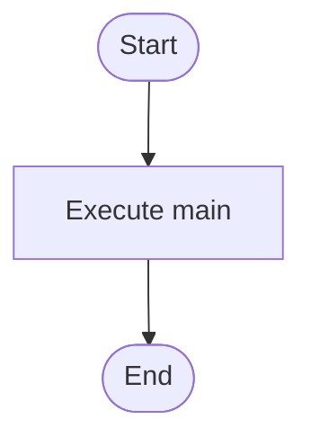

# main.cpp

- Source: Microservice/main.cpp
- Kind: C++ implementation
- Lines: 10
- Role: Thin executable entrypoint that delegates to the syntactic broken AST runner.
- Chronology: Executable handoff point: it forwards control into the application-layer runner.

## Notable Symbols
- run_syntactic_broken_ast
- main

## Direct Dependencies
- iostream

## Implementation Story
This file implements the thinnest possible executable entrypoint. It accepts process control from the OS, forwards the arguments to the syntactic broken AST runner, and returns that runner's exit code unchanged. Thin executable entrypoint that delegates to the syntactic broken AST runner. Executable handoff point: it forwards control into the application-layer runner. The implementation surface is easiest to recognize through symbols such as run_syntactic_broken_ast and main. In practice it collaborates directly with iostream.

## Activity Diagram

## Documentation Note
- This markdown file is part of the generated docs/Codebase mirror.
- It was generated from the repository state on 2026-04-22 after reading the existing docs corpus and the current source tree.

