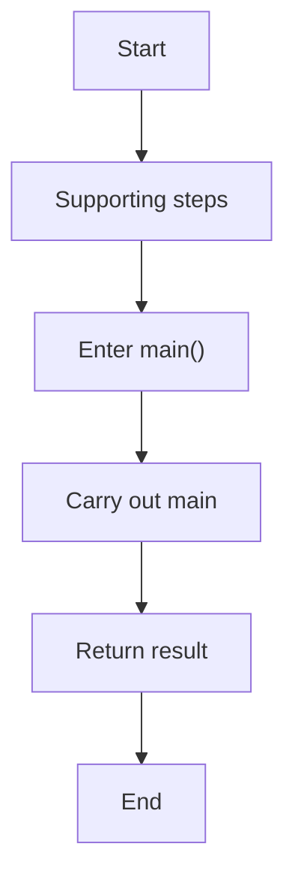
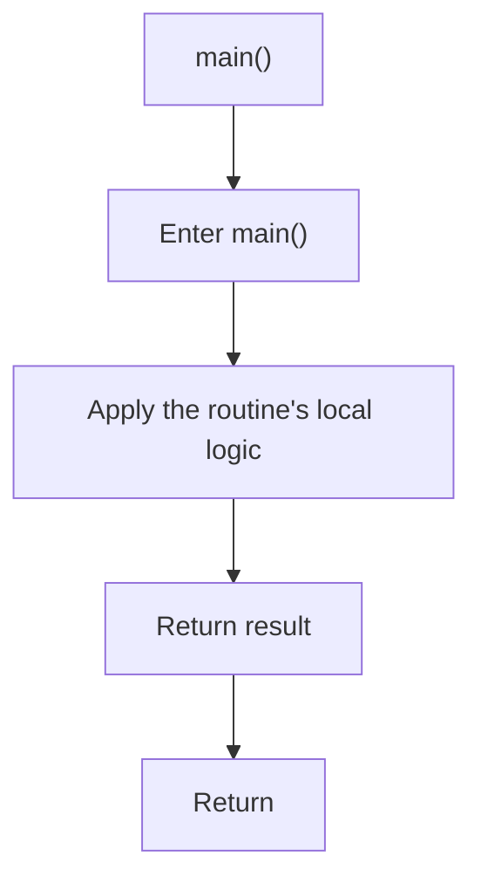

# main.cpp

- Source: Microservice/main.cpp
- Kind: C++ implementation
- Lines: 10

## Story
### What Happens Here

This file implements the thinnest possible executable entrypoint. It accepts process control from the OS, forwards the arguments to the syntactic broken AST runner, and returns that runner's exit code unchanged.

### Why It Matters In The Flow

Executable handoff point: it forwards control into the application-layer runner.

### What To Watch While Reading

Thin executable entrypoint that delegates to the syntactic broken AST runner. The main surface area is easiest to track through symbols such as run_syntactic_broken_ast and main. It collaborates directly with iostream.

## Program Flow
This diagram follows the action path in plain words. Decision diamonds show where the file can stop, branch, or repeat work instead of simply passing through a straight line.

## Reading Map
Read this file as: Thin executable entrypoint that delegates to the syntactic broken AST runner.

Where it sits in the run: Executable handoff point: it forwards control into the application-layer runner.

Names worth recognizing while reading: run_syntactic_broken_ast and main.

It leans on nearby contracts or tools such as iostream.

## Story Groups

### Supporting Steps
These steps support the local behavior of the file.
- main() (line 5): Owns a focused local responsibility.

## Function Stories

### main()
This routine owns one focused piece of the file's behavior. It appears near line 5.

The caller receives a computed result or status from this step.

What it does:
- This routine is primarily structural and does not expose obvious runtime operations from static inspection.

Flow:

## Documentation Note
- This markdown file is part of the generated docs/Codebase mirror.
- It was generated from the repository state on 2026-04-23 after reading the existing docs corpus and the current source tree.

