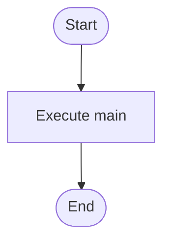

# main.cpp

- Source: Microservice/main.cpp
- Kind: C++ implementation
- Lines: 10
- Role: Thin executable entrypoint that delegates to the syntactic broken AST runner.
- Chronology: Executable handoff point: it forwards control into the application-layer runner.

## Notable Symbols
- run_syntactic_broken_ast
- main

## Direct Dependencies
- iostream

## File Outline
### Responsibility

This file implements the thinnest possible executable entrypoint. It accepts process control from the OS, forwards the arguments to the syntactic broken AST runner, and returns that runner's exit code unchanged.

### Position In The Flow

Executable handoff point: it forwards control into the application-layer runner.

### Main Surface Area

Thin executable entrypoint that delegates to the syntactic broken AST runner. The main surface area is easiest to track through symbols such as run_syntactic_broken_ast and main. It collaborates directly with iostream.

## File Activity


## Function Walkthrough

### main
This routine owns one focused piece of the file's behavior. It appears near line 5.

The caller receives a computed result or status from this step.

Key operations:
- This routine is primarily structural and does not expose obvious runtime operations from static inspection.

Activity:
```mermaid
flowchart TD
    Start([main()])
    N0[Enter main()]
    N1[Apply the routine's local logic]
    N2[Return the result to the caller]
    End([Return])
    Start --> N0
    N0 --> N1
    N1 --> N2
    N2 --> End
```

## Documentation Note
- This markdown file is part of the generated docs/Codebase mirror.
- It was generated from the repository state on 2026-04-23 after reading the existing docs corpus and the current source tree.

