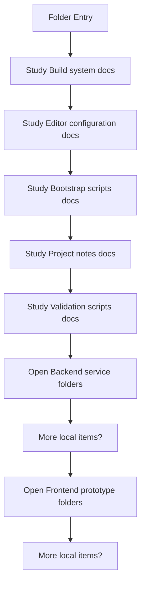
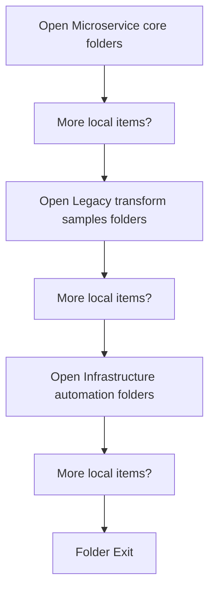

# Codebase Mirror

- Folder: docs/Codebase
- Descendant source docs: 147
- Generated on: 2026-04-23

## Logic Summary
Top-level logical view of the generated codebase mirror. It groups the repository into runtime entrypoints, frontend prototype code, backend service code, infrastructure automation, legacy transform samples, and the C++ microservice core.

## Blueprint Boundary
This `docs/Codebase` tree is the implementation mirror. Folders and Markdown files here should map to current or planned code folders/files.

Granular Mermaid details stay inside the Markdown file they describe. Do not create documentation-only detail folders inside this mirror.

Every normal folder in this tree should be safe to treat as a current or planned implementation folder.

## Subsystem Story
This folder mixes concrete local documents with deeper child subsystems. Read the local docs to understand the visible behavior first, then descend into the child folders for the lower-level detail that supports it.

## Folder Flow

### Block 1 - Folder Flow Details
#### Slice 1 - Continue Local Flow

#### Slice 2 - Continue Local Flow

## Child Folders By Logic
### Backend Service
These child folders continue the subsystem by covering Backend service surface. This area groups the Express entrypoint, package metadata, and the HTTP runtime internals under src.
- Backend/ : Backend service surface. This area groups the Express entrypoint, package metadata, and the HTTP runtime internals under src.

### Frontend Prototype
These child folders continue the subsystem by covering Frontend prototype shell. This area groups the browser entrypoint with route fragments, scripts, and styles.
- Frontend/ : Frontend prototype shell. This area groups the browser entrypoint with route fragments, scripts, and styles.

### Microservice Core
These child folders continue the subsystem by covering C++ executable and module tree that implement the parser, detector, documentation tagging, rendering, and report pipeline.
- Microservice/ : C++ executable and module tree that implement the parser, detector, documentation tagging, rendering, and report pipeline.

### Legacy Transform Samples
These child folders continue the subsystem by covering Legacy pattern-to-pattern transform examples kept for historical comparison with the current tagging-first system.
- LegacyPatternTransformSamples/ : Legacy pattern-to-pattern transform examples kept for historical comparison with the current tagging-first system.

### Infrastructure Automation
These child folders continue the subsystem by covering Infrastructure automation and runtime environment assembly for local containerized execution.
- Infrastructure/ : Infrastructure automation and runtime environment assembly for local containerized execution.

## Documents By Logic
### Build System
These documents explain the local implementation by covering Builds the NeoTerritory executable from the microservice layer and module sources. and Stores IDE-oriented CMake configuration defaults.
- CMakeLists.txt.md : Builds the NeoTerritory executable from the microservice layer and module sources.
- CMakeSettings.json.md : Stores IDE-oriented CMake configuration defaults.

### Editor Configuration
These documents explain the local implementation by covering Provides editor include-path and IntelliSense settings.
- CppProperties.json.md : Provides editor include-path and IntelliSense settings.

### Bootstrap Scripts
These documents explain the local implementation by covering Windows bootstrap wrapper that ensures elevation and delegates to infrastructure automation. and Shell bootstrap entrypoint for non-Windows setup flows.
- setup.ps1.md : Windows bootstrap wrapper that ensures elevation and delegates to infrastructure automation.
- setup.sh.md : Shell bootstrap entrypoint for non-Windows setup flows.

### Project Notes
These documents explain the local implementation by covering Keeps loose repository-level notes outside the formal docs set.
- Notes.md : Keeps loose repository-level notes outside the formal docs set.

### Validation Scripts
These documents explain the local implementation by covering Shell helper for local compile or execution checks.
- test.sh.md : Shell helper for local compile or execution checks.

## Reading Hint
- Read the local file docs first for concrete behavior, then descend into the child folders for narrower subsystem details.
