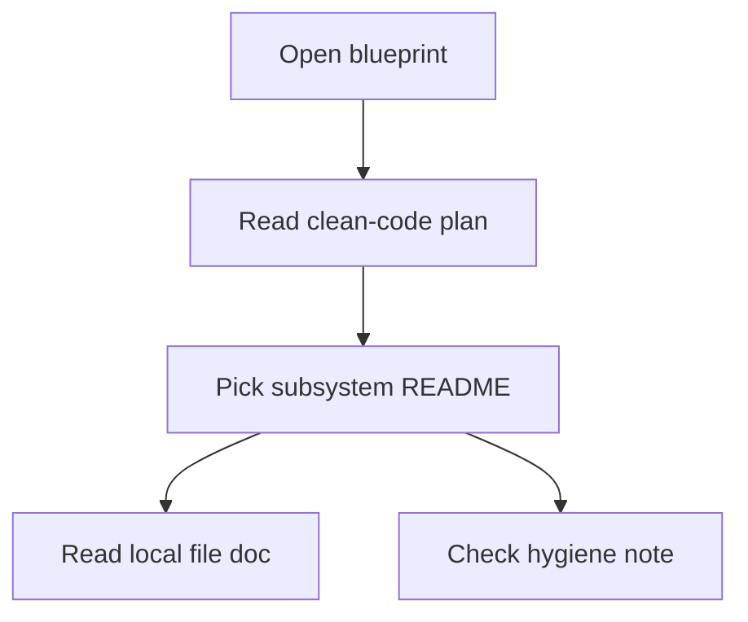

# Codebase Blueprint

- Folder: `docs/Codebase`
- Role: blueprint entrypoint for the repository's source, runtime, and hygiene docs

## Read First
Start here when you need the current blueprint, then move into the folder that owns the work.

## What This Folder Covers
This tree mirrors planned or current implementation structure, not generated output. Each markdown file explains one file, folder, or bounded subsystem.

The main entry paths are:
- `CLEAN_CODE_ARCHITECTURE_PLAN.md` for repo-wide slice rules, naming, docs architecture, root hygiene, and Git hygiene.
- `Backend/README.md`, `Frontend/README.md`, `Microservice/README.md`, and `Infrastructure/README.md` for subsystem boundaries.
- `Notes.md` for loose repository notes that do not belong in the formal blueprint.
- `start.ps1.md`, `start.sh.md`, and `vercel.json.md` for root dispatcher and deploy behavior.
- `.gitignore.md` for tracked-vs-local artifact policy.

## Boundary Rules
- Keep docs local to the code unit they describe.
- Use folder `README.md` files as read-order and ownership guides.
- Avoid documentation-only support folders under `docs/Codebase`.
- Treat the root of the repo as a thin surface: source, docs, manifests, and deliberate fixtures belong there; build output, caches, and local scratch files do not.
- Keep Git hygiene explicit. If a file is local, generated, secret, or machine-specific, it should stay out of version control unless the blueprint says otherwise.

## Folder Map
- `Backend/` covers backend orchestration and runtime API behavior.
- `Frontend/` covers the browser application and UI workflows.
- `FrontendNext/` covers the next-app surface when that track is active.
- `Microservice/` covers the C++ analysis engine, runtime layout, and tests.
- `Infrastructure/` covers bootstrap, session orchestration, and CI/runtime docs.
- `LegacyPatternTransformSamples/` covers historical comparison inputs.

## Notes For Readers
- When a document looks stale, trust the folder ownership and the current subsystem README first.
- When a path is ambiguous, stop at the nearest README and read outward only if the change crosses a boundary.
