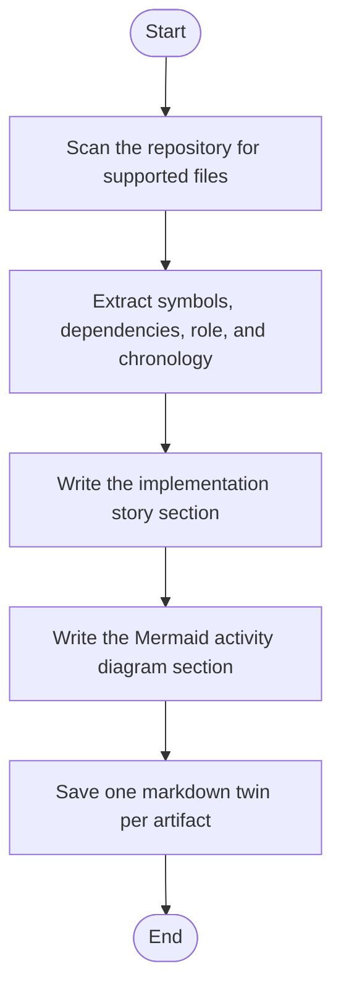

# Codebase Mirror

This directory mirrors the current NeoTerritory source tree with one markdown file per source or configuration artifact. Each generated document keeps the source filename and appends .md.

- Generated on: 2026-04-22
- Documented files: 152
- Story doc: ../CODEBASE_STORY.md

## Top-Level Coverage
- Backend : 14 files
- Frontend : 15 files
- Infrastructure : 7 files
- Input : 5 files
- Microservice : 104 files
- RepositoryRoot : 7 files

## Root-Level File Docs
- ./CMakeLists.txt.md
- ./CMakeSettings.json.md
- ./CppProperties.json.md
- ./Notes.md
- ./setup.ps1.md
- ./setup.sh.md
- ./test.sh.md

## Generation Note
- The generated mirror is intentionally structural and navigational.
- The higher-level chronology, architecture story, and Mermaid diagrams live in docs/CODEBASE_STORY.md.

## Implementation Story
This generated directory is the per-file narrative layer for the repository. The generation process walks the source and configuration tree, creates a markdown twin for each supported artifact, summarizes its role and chronology, and now adds a short implementation story plus a Mermaid activity diagram so each file can be read as part of a flow instead of as an isolated path.

## Activity Diagram

