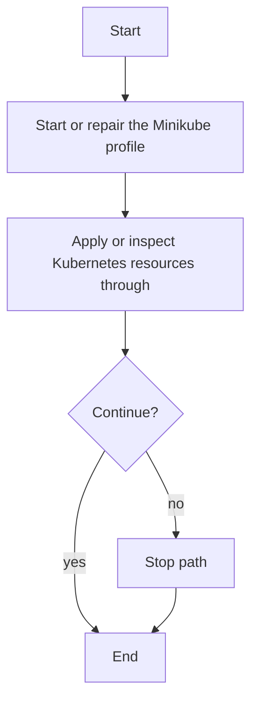

# setup.ps1

- Source: setup.ps1
- Kind: PowerShell script
- Lines: 88

## Story
### What Happens Here

This script is the Windows bootstrap doorway for the repository. Its implementation checks for Administrator privileges, relaunches when elevation is required, preserves incoming parameters, and then hands control to the infrastructure bootstrap so the environment is ready before any service or executable is run.

### Why It Matters In The Flow

Usually the first Windows entrypoint: it elevates, forwards parameters, and starts infrastructure bootstrap.

### What To Watch While Reading

Windows bootstrap wrapper that ensures elevation and delegates to infrastructure automation. The main surface area is easiest to track through symbols such as $ConfigPath, $UserId, $Image, and $RuntimeRoot. It collaborates directly with kubectl, minikube, wsl, and Codebase/Infrastructure/session-orchestration/bootstrap_and_deploy.ps1.

## Program Flow
This diagram follows the action path in plain words. Decision diamonds show where the file can stop, branch, or repeat work instead of simply passing through a straight line.

## Reading Map
Read this file as: Windows bootstrap wrapper that ensures elevation and delegates to infrastructure automation.

Where it sits in the run: Usually the first Windows entrypoint: it elevates, forwards parameters, and starts infrastructure bootstrap.

Names worth recognizing while reading: $ConfigPath, $UserId, $Image, $RuntimeRoot, $SkipDependencyInstall, and $SkipDockerStart.

It leans on nearby contracts or tools such as kubectl, minikube, wsl, and Codebase/Infrastructure/session-orchestration/bootstrap_and_deploy.ps1.

## Documentation Note
- This markdown file is part of the generated docs/Codebase mirror.
- It was generated from the repository state on 2026-04-23 after reading the existing docs corpus and the current source tree.

