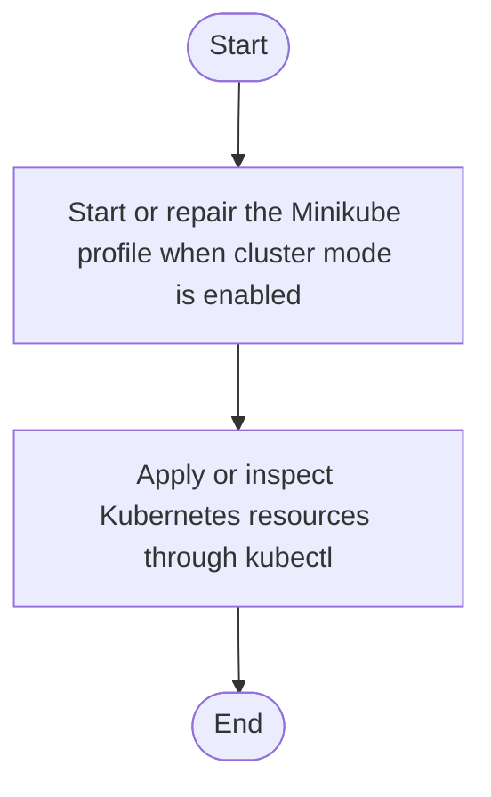

# setup.ps1

- Source: setup.ps1
- Kind: PowerShell script
- Lines: 88
- Role: Windows bootstrap wrapper that ensures elevation and delegates to infrastructure automation.
- Chronology: Usually the first Windows entrypoint: it elevates, forwards parameters, and starts infrastructure bootstrap.

## Notable Symbols
- $ConfigPath
- $UserId
- $Image
- $RuntimeRoot
- $SkipDependencyInstall
- $SkipDockerStart
- $SkipClusterStart
- $SkipImageBuild
- $SkipDeploy
- $SkipRuntimeLayout
- $LegacyWslToolsInstall
- $ErrorActionPreference

## Direct Dependencies
- kubectl
- minikube
- wsl
- Codebase/Infrastructure/session-orchestration/bootstrap_and_deploy.ps1

## File Outline
### Responsibility

This script is the Windows bootstrap doorway for the repository. Its implementation checks for Administrator privileges, relaunches when elevation is required, preserves incoming parameters, and then hands control to the infrastructure bootstrap so the environment is ready before any service or executable is run.

### Position In The Flow

Usually the first Windows entrypoint: it elevates, forwards parameters, and starts infrastructure bootstrap.

### Main Surface Area

Windows bootstrap wrapper that ensures elevation and delegates to infrastructure automation. The main surface area is easiest to track through symbols such as $ConfigPath, $UserId, $Image, and $RuntimeRoot. It collaborates directly with kubectl, minikube, wsl, and Codebase/Infrastructure/session-orchestration/bootstrap_and_deploy.ps1.

## File Activity

## Documentation Note
- This markdown file is part of the generated docs/Codebase mirror.
- It was generated from the repository state on 2026-04-23 after reading the existing docs corpus and the current source tree.

