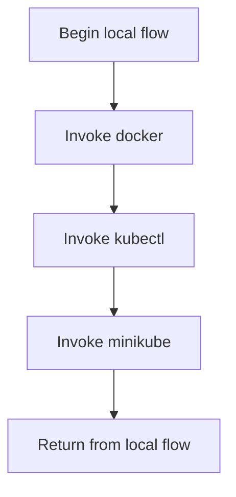

# setup.sh

- Source: setup.sh
- Kind: Shell script

## Story
### What Happens Here

This script is the shell-side repository bootstrap entrypoint. Its implementation exists to prepare or delegate the non-Windows setup path before the rest of the toolchain is used.

### Why It Matters In The Flow

Usually the first POSIX entrypoint: it starts repository setup outside the Windows path.

### What To Watch While Reading

Shell bootstrap entrypoint for non-Windows setup flows. It collaborates directly with docker, kubectl, and minikube.

## Program Flow
This diagram follows the action path in plain words. Decision diamonds show where the file can stop, branch, or repeat work instead of simply passing through a straight line.

## Reading Map
Read this file as: Shell bootstrap entrypoint for non-Windows setup flows.

Where it sits in the run: Usually the first POSIX entrypoint: it starts repository setup outside the Windows path.

It leans on nearby contracts or tools such as docker, kubectl, and minikube.

## Documentation Note
- This markdown file is part of the generated docs/Codebase mirror.
- It was generated from the repository state on 2026-04-23 after reading the existing docs corpus and the current source tree.

