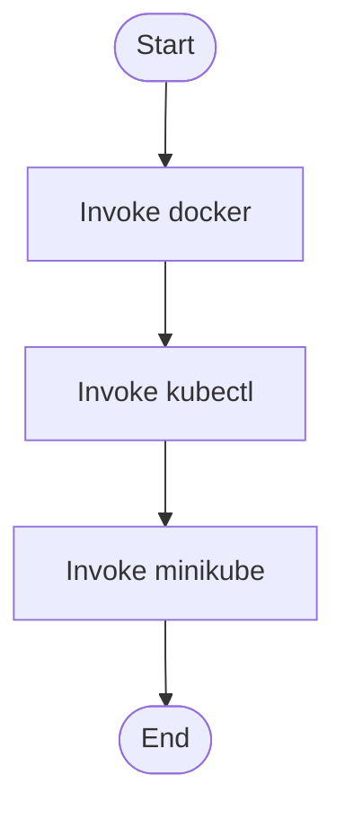

# setup.sh

- Source: setup.sh
- Kind: Shell script
- Lines: 26
- Role: Shell bootstrap entrypoint for non-Windows setup flows.
- Chronology: Usually the first POSIX entrypoint: it starts repository setup outside the Windows path.

## Notable Symbols
- This artifact is primarily declarative or inline and does not expose many named symbols.

## Direct Dependencies
- docker
- kubectl
- minikube

## File Outline
### Responsibility

This script is the shell-side repository bootstrap entrypoint. Its implementation exists to prepare or delegate the non-Windows setup path before the rest of the toolchain is used.

### Position In The Flow

Usually the first POSIX entrypoint: it starts repository setup outside the Windows path.

### Main Surface Area

Shell bootstrap entrypoint for non-Windows setup flows. It collaborates directly with docker, kubectl, and minikube.

## File Activity

## Documentation Note
- This markdown file is part of the generated docs/Codebase mirror.
- It was generated from the repository state on 2026-04-23 after reading the existing docs corpus and the current source tree.

