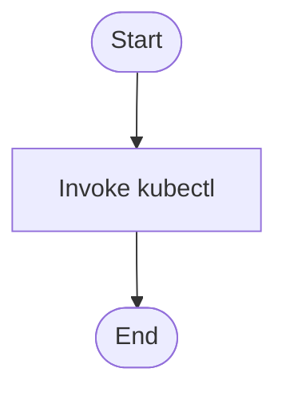

# test.sh

- Source: test.sh
- Kind: Shell script
- Lines: 21
- Role: Shell helper for local compile or execution checks.
- Chronology: This artifact participates in the repository flow according to the surrounding module or toolchain that loads it.

## Notable Symbols
- This artifact is primarily declarative or inline and does not expose many named symbols.

## Direct Dependencies
- kubectl

## Implementation Story
This script acts as a quick validation entrypoint. Its implementation is part of the lightweight outer loop around the codebase, helping the repository move from setup to verification. Shell helper for local compile or execution checks. This artifact participates in the repository flow according to the surrounding module or toolchain that loads it. In practice it collaborates directly with kubectl.

## Activity Diagram

## Documentation Note
- This markdown file is part of the generated docs/Codebase mirror.
- It was generated from the repository state on 2026-04-22 after reading the existing docs corpus and the current source tree.

