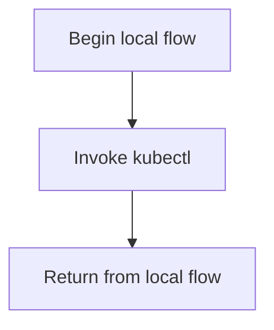

# test.sh

- Source: test.sh
- Kind: Shell script

## Story
### What Happens Here

This script acts as a quick validation entrypoint. Its implementation is part of the lightweight outer loop around the codebase, helping the repository move from setup to verification.

### Why It Matters In The Flow

This artifact participates in the repository flow according to the surrounding module or toolchain that loads it.

### What To Watch While Reading

Shell helper for local compile or execution checks. It collaborates directly with kubectl.

## Program Flow
This diagram follows the action path in plain words. Decision diamonds show where the file can stop, branch, or repeat work instead of simply passing through a straight line.

## Reading Map
Read this file as: Shell helper for local compile or execution checks.

Where it sits in the run: This artifact participates in the repository flow according to the surrounding module or toolchain that loads it.

It leans on nearby contracts or tools such as kubectl.

## Documentation Note
- This markdown file is part of the generated docs/Codebase mirror.
- It was generated from the repository state on 2026-04-23 after reading the existing docs corpus and the current source tree.

